# Yakker - Front-End

## User Experience (UX)

### User Stories

- Users: 

    - Authentication

    1. As a **user** I can **easily log in** so that **I can quickly post, add more comments, or delete content if I wish.**

    2. As a **user** I can **easily log out** so that **I can have more security on my account.**

    3. As a **user** I can **sign up easily with just a username and password** so that **I have the ability to create posts or comments without having to share my email address.**

    4. As a **user** I **cannot edit/delete posts/comments/likes that are not mine** so that **I can be assured that my posts/comments/likes are protected and can only be changed by me.**

    5. As a **user** I can **only like/unlike other users' posts and comments** so that **I can only show my appreciation for other posts/comments and not cheat the system by liking my own posts/comments.**

    6. As a **user** I can **only follow other users** so that **I cannot cheat the system and follow myself and gain myself a new, false follower.**

    7. As a **user** I can **see whether I am logged in or not** so that **I will know if I will need to log in if I am not.**

    8. As a **user** I can **maintain my logged-in status** so that **I will not need to constantly log in when not on the website for a few hours, and can log out manually whenever I want to log out.**

    - Posts

    1. As a **user** I can **create new posts** so that **I can share images, my thoughts, or what I'm doing.**

    2. As a **user** I can **edit posts** so that **I can change my posts, images, etc whenever I change my mind about what I posted or wish to remove/add details.**

    3. As a **user** I can **delete my posts** so that **I can get rid of my posts that I no longer want to be shared.**

    4. As a **user** I can **view the details of a post** so that **I can read more information about the post such as when it was created, who created it, if it was edited, read the comments, etc.**

    5. As a **user** I can **like posts** so that **I can share my appreciation for the post and show the world and the author that their post is great.**

    6. As a **user** I can **remove likes on a post** so that **I can change my mind about whether I like the post or not.**

    - Comments

    1. As a **user** I can **post a comment on a post** so that **I can contribute discussion to a post or share my thoughts about a post.**

    2. As a **user** I can **delete my comments on a post** so that **I can remove comments if I no longer want my comments to be public.**

    3. As a **user** I can **read comments on a post** so that **I can read what others think about the post and read the discussion happening.**

    4. As a **user** I can **edit my comments** so that **have the possibility to remove or add more details to my existing comments.**

    5. As a **user** I can **like comments** so that **I can share my appreciation for the comment.**

    6. As a **user** I can **unlike comments** so that **I can change my mind about my positive feelings towards a comment.**

    - Navigation

    1. As a **user** I can **a nice 500 page consistent with the site layout** so that **I can be communicated with if there are issues with the website's server or backend.**

    2. As a **user** I can **have the navigation bar customed to my logged-in or out status** so that **I can have the options to log in or sign up when logged out, or have the options to create a post, view my profile, sign out, etc when logged in.**

    3. As a **user** I can **a nice 404 page consistent with the site layout** so that **I can be communicated with if I have reached an invalid web page.**

    4. As a **user** I can **navigate through pages quickly** so that **I can view content smoothly without the pages being refreshed**

    5. As a **user** I can **see the navigation bar at the top of every page** so that **I can easily navigate between pages.**

    6. As a **user** I can **infinitely scroll down to see more posts and also to see more comments** so that **I can consistently look at more posts/comments without having to click any extra links to view more.**

    - Profile

    1. As a **user** I can **view user avatars** so that **easily identify users of the website.**

    2. As a **user** I can **view a detailed page of users** so that **I can see their posts and learn more about the user. I can also see their following count, followers count, etc.**

    3. As a **user** I can **follow or unfollow other users** so that **I can see or choose to remove posts by specific users in my posts feed.**

    - General

    1. As a **user** I can **search for posts or users in a search box** so that **I can quickly find specific posts or users that I am wanting to look for.**

    2. As a **user** I can **easily find the 'About' link in the nav bar** so that **I can learn about the purpose of this website which will be crucial as a new user coming to the website.**

### Design

- Colour Scheme:

 - Typography

### Wireframes

- Wireframes have been created using the program Whimsical

Website Feed:

Screenshot of Desktop Wireframe: Website Feed

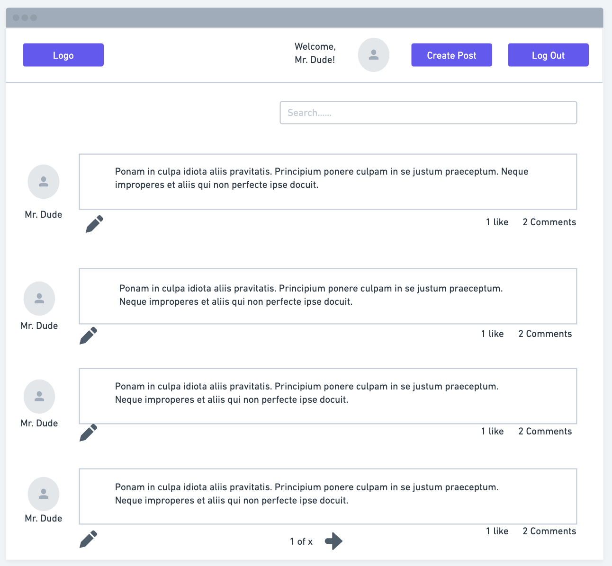

Screenshot of Desktop Logged Out Wireframe: Website Feed

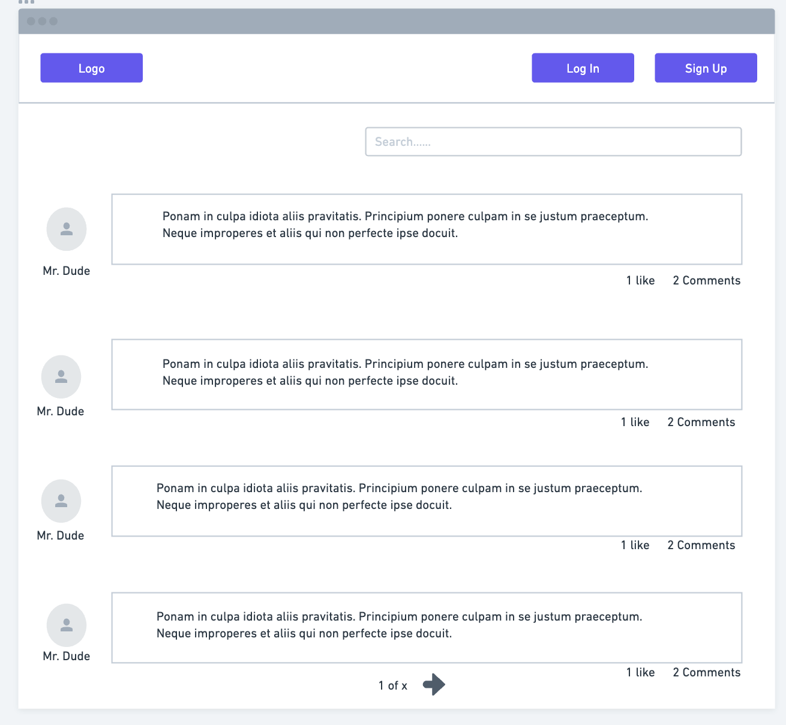

Screenshot of Mobile Wireframe: Website Feed

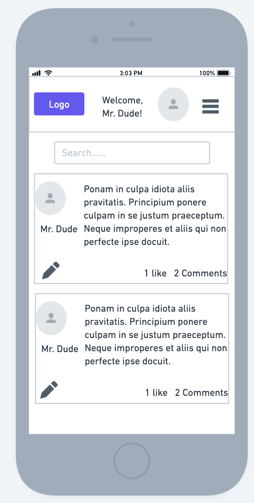

Screenshot of Tablet Wireframe: Website Feed

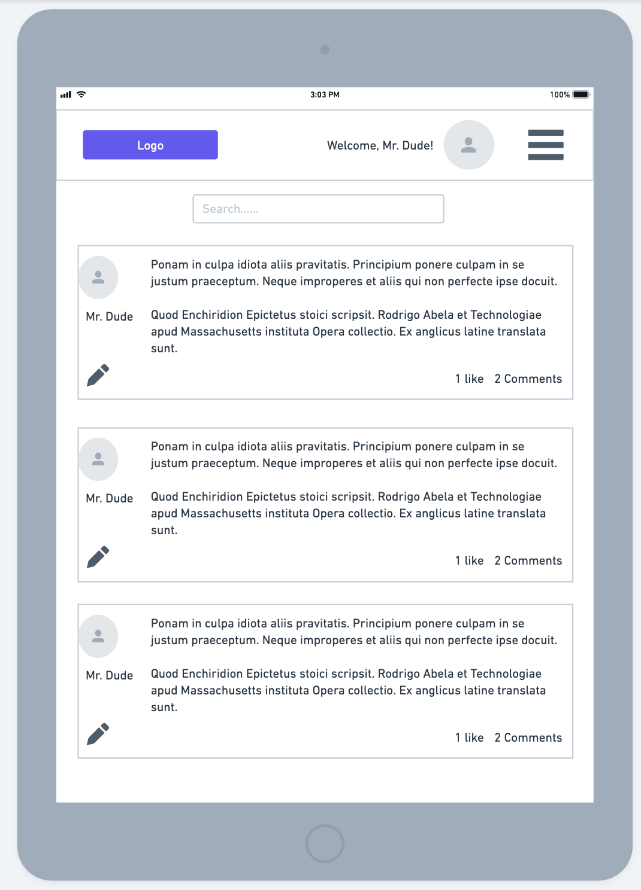

Create Post: 

Screenshot of Desktop Wireframe: Create Post

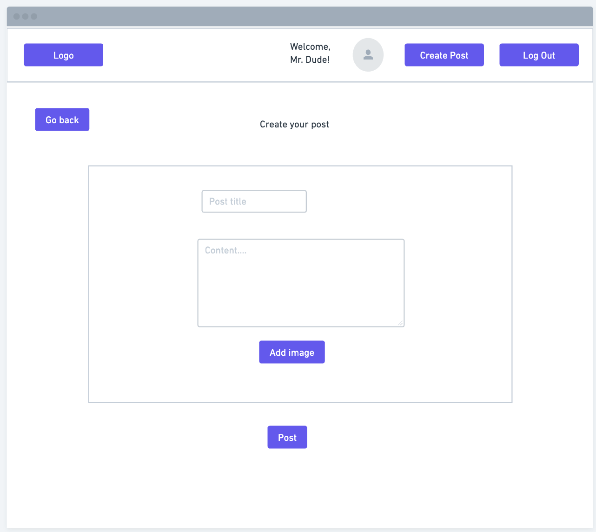

Screenshot of Mobile Wireframe: Create Post

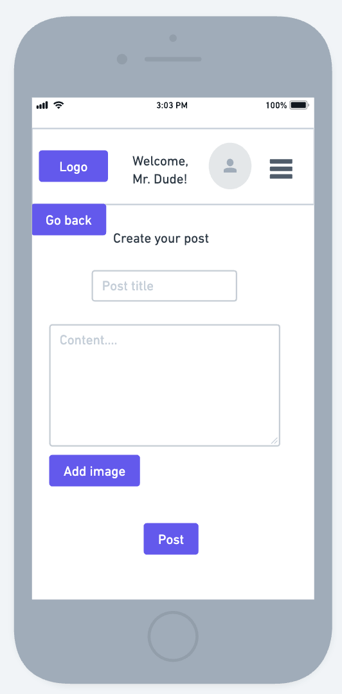

Screenshot of Tablet Wireframe: Create Post

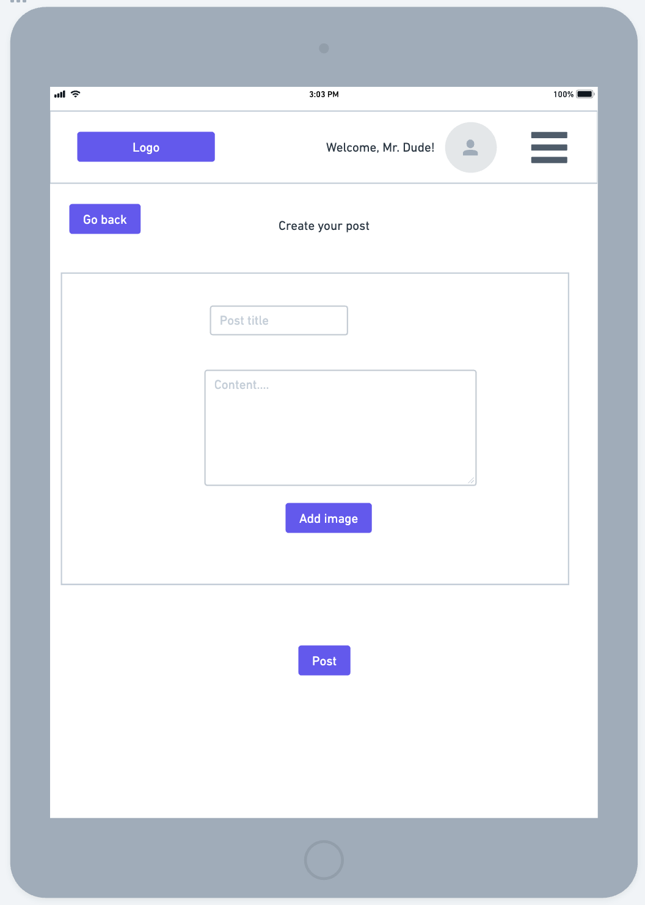

Post Detailed View:

Screenshot of Desktop Wireframe: Post Detailed View

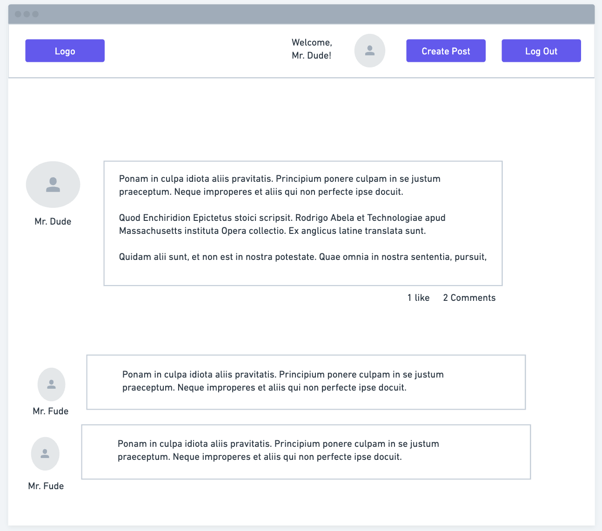

Screenshot of Mobile Wireframe: Post Detailed View

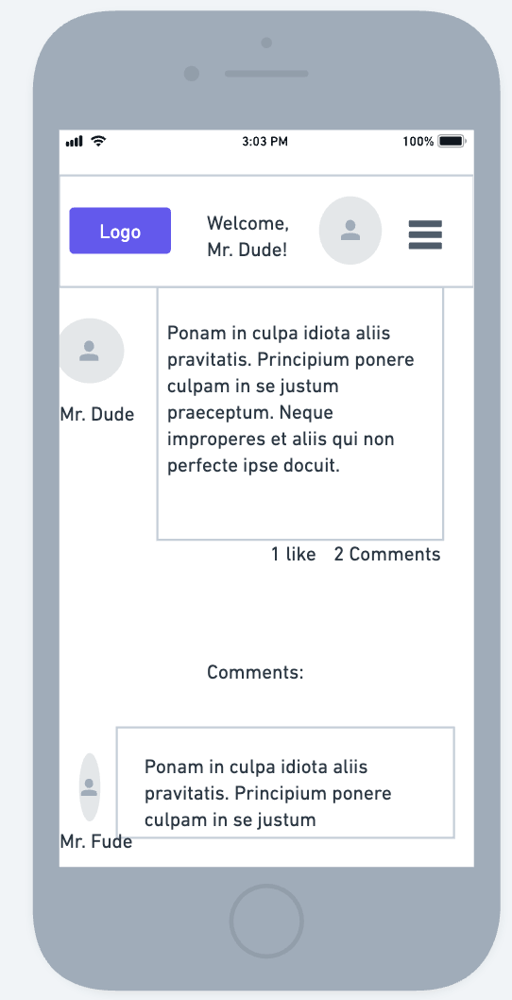

Screenshot of Tablet Wireframe: Post Detailed View

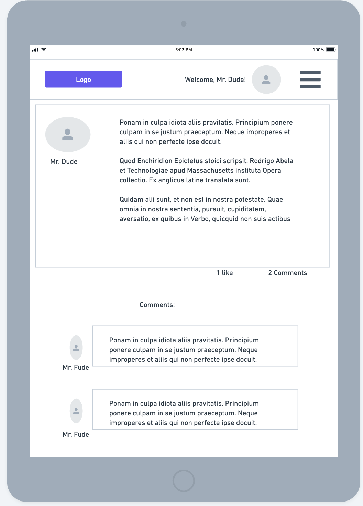

Profile Page:

Screenshot of Desktop Wireframe: Profile Page

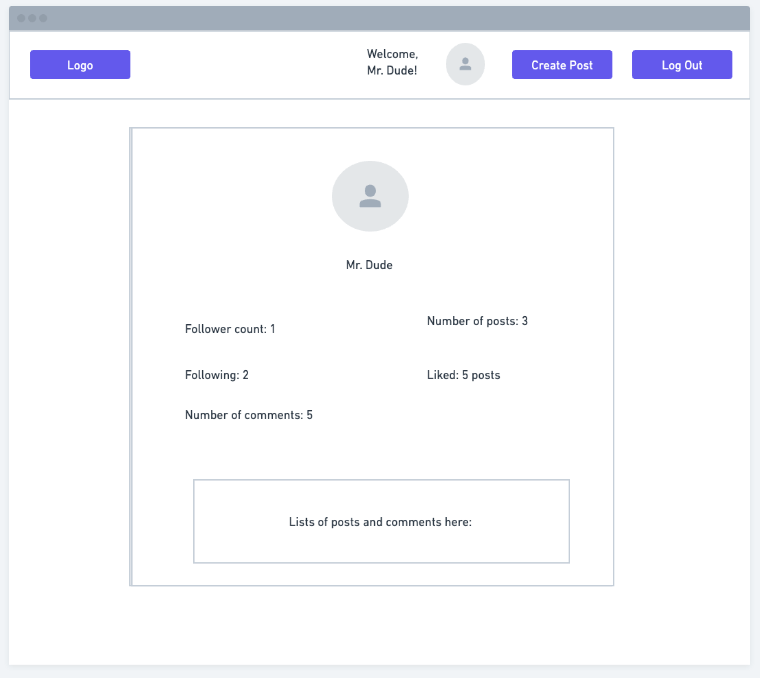

Screenshot of Mobile Wireframe: Profile Page

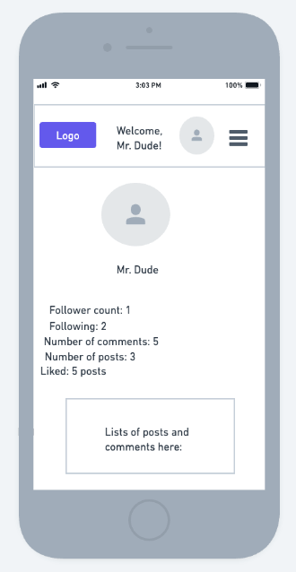

Screenshot of Tablet Wireframe: Profile Page

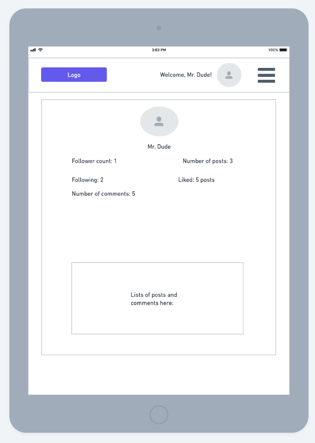

### Kanban Board

## Features

### Existing Features

### Future Features

## Technologies Used

### Languages and Packages/Libraries Used

1. [Django](https://www.djangoproject.com/)

2. [Python](https://www.python.org/)

3. [HTML5](https://en.wikipedia.org/wiki/HTML5)

4. [CSS3](https://en.wikipedia.org/wiki/CSS)

5. [JavaScript](https://www.javascript.com/)

6. [psycopg2](https://pypi.org/project/psycopg2/)

7. [Django allauth](https://django-allauth.readthedocs.io/en/latest/installation.html)

8. [Bootstrap 5](https://getbootstrap.com/docs/5.0/getting-started/introduction/)

9. [gunicorn](https://gunicorn.org/)

10. [PostgreSQL](https://www.postgresql.org/)

### Programs Used

1. [Git](https://git-scm.com/)
    - Git was used by utilizing the Gitpod terminal to commit to Git and Push to GitHub. Version control. 

2. [GitHub](https://github.com/)
    - GitHub was used to store the project code after being pushed in by Git. Project repository linked with Heroku for deployment process. GitHub was also used to create the kanban board. 

3. [Heroku](https://dashboard.heroku.com/login)
    - Heroku was used to deploy this project. Heroku's Postgres was used as the database.  

4. [Whimsical](https://whimsical.com)
    - Whimsical was used to create the data model and the wireframes for the project. 

5. [PEP8 Online Check](http://pep8online.com/)
    - PEP8 Online Check was used to validate the Python code used and check for warnings/errors. 

6. [Ecotrust-Canada Markdown-toc](https://ecotrust-canada.github.io/markdown-toc/)
    - Ecotrust-Canada Markdown was used to create the table of contents for this README. 

7. [W3C Validator](https://validator.w3.org/)
    - W3C validator used to check the HTML5 code.

8. [W3C CSS Validator](https://jigsaw.w3.org/css-validator/)
    - W3C CSS validator used to check the CSS3 code.

9. [JSHint](https://jshint.com/)
    - JSHint used to check the JavaScript code. 

10. [Cloudinary](https://cloudinary.com/)
    - Cloudinary used to host the uploaded images.

11. [Font Awesome](https://fontawesome.com/)
    - Font Awesome was used for icons.

12. [Google Fonts](https://fonts.google.com/)
    - Google Fonts was used for the Permanent Marker and Oswald fonts. 

13. [Favicon.io](https://favicon.io/)
    - Favicon.io was used for the favicon.

14. [Autopep8](https://pypi.org/project/autopep8/)
    - Autopep8 was used to help organize Python code to match PEP8 standards.

15. Beautify
    - Beautify Command Palette on Git was used to organize the code in all files.

16. [Coolors](https://coolors.co/)
    - Coolors was used to get the specific red (#5F021F) colour used in the project. 

## Testing

### Validation Testing & Lighthouse

### Manual Testing

### Bugs 

## Deployment

- The following steps were taken for the deployment process (taken from the I Think Therefore I Blog project):

    **Project creation and initial deployment**
    1. Ensure that the template used for the project is made with the Code Institute template linked [here](https://github.com/Code-Institute-Org/gitpod-full-template). 
    2. Using pip3, install **[Django gunicorn](https://www.djangoproject.com/)**
    3. Using pip3, install **dj_database_url psycopg2**
    4. Using pip3, install **dj3-cloudinary-storage**
    5. Run **pip3 freeze --local > requirements.txt** so installments /dependencies can work on Heroku.
    6. Create Django project using **django-admin startproject** on terminal
    7. Create Django app using **python3 manage.py startapp** on terminal
    8. In settings.py, add installed the app under **INSTALLED_APPS**
    9. Any changes in database (changing models, creating a new app), run migrations to the database using the command **python3 manage.py makemigrations** and then **python3 manage.py migrate**
    10. [Create an account for Heroku](https://id.heroku.com/login)
    11. On the Heroku dashboard, go to **Create new app**, give it a name and select region and submit.
    12. On Heroku, under **Resources**, search up **Postgres** in **Add-ons** and select **Heroku Postgres**.
    13. On Heroku, under the **Settings** tab, click on **Reveal Config vars**, copy the **DATABASE_URL**. 
    14. In Gitpod, create a file called **env.py** (should already be in git ignore file in template used). Import os, and set up the **DATABASE_URL** environment variable where the Heroku **DATABASE_URL** will be pasted. 
    15. In **env.py**, also create another environment variable for **SECRET_KEY** and create your secret key. Copy the **SECRET_KEY** value.
    16. In Heroku, in **Config vars**, create a new **Config var** for **SECRET_KEY** and paste your secret key and click add. 
    16. In Gitpod, go to **settings.py** and import os. Import **dj_database_url** and create if statement to check if **env.py** is a file, to import **env**.
    17. In **SECRET_KEY** section in **settings.py**, import os.environ **SECRET_KEY**.
    18. In **settings.py**, comment out the **DATABASES** and add in **DATABASES** to add **dj_database_url** from **env.py** file. 
    19. In Heroku, add another **Config var**, KEY: PORT/ Value: 8000
    20. Create a [Cloudinary account](https://cloudinary.com/). Copy the **API Environment variable**
    21. In Gitpod, in **env.py**, add in the **CLOUDINARY_URL** and paste the **API Environment variable**.
    22. In Heroku, create another **Config var** for **CLOUDINARY_URL** and paste in the value from **API Environment variable**
    23. In Heroku, add another key for **DISABLE_COLLECTSTATIC** and set it to **1** since there are no static files currently. 
    24. In **settings.py**, add in Cloudinary libraries under **INSTALLED_APPS**
    25. In **settings.py**, add in **STATICFILES_STORAGE** to install Cloudinary further. Also set up **STATICFILES_DIRS** to connect to static. Create **MEDIA_URL** for **/media/** and set **DEFAULT_FILE_STORAGE** for Cloudinary media storage. 
    26. At the top of **settings.py**, create **TEMPLATES_DIR** to join base directory and templates.
    27. In **settings.py**, set **DIRS** in **TEMPLATES** to match **DIRS** to **TEMPALTE_DIR**.
    28. In **settings.py**, add your Heroku app name followed by herokuapp.com in **ALLOWED_HOSTS**, as well as **localhost**.
    29. In Gitpod, create **media**, **static**, and **templates** folders. 
    30. In Gitpod, create a **Procfile**. Type in **web: gunicorn [projectname].wsgi**
    31. Commit and push these changes onto GitHub.
    32. In Heroku, under the **deploy** tab, choose **GitHub** as deployment method, login to GitHub, and search for your project repo. Click **manual deploy** (or **automatic deploy** if you want GitHub pushes to deploy to Heroku each time)
    33. When deployment is successful, click **open app** to see your deployment. 
    **Final deplyoment**
    34. In **settings.py**, ensure **DEBUG** is **False** !!!!!!
    35. In **settings.py**, create the setting **X_FRAME_OPTIONS** and set to **SAMEORIGIN**.
    36. Commit and push these changes onto GitHub.
    37. In Heroku, in **Reveal Config Vars**, remove **DISABLE_COLLECTSTATIC** variable. Under **Deploy**, scroll down to bottom and deploy branch. 

- The following steps were taken for the cloning process: 

  1. Log in to **[GitHub](https://github.com/)**.
  2. Click on the profile icon to locate **'Your repositories'**. 
  3. On the repository page, click on the repository you wish to clone.
  4. Under **'Code'**, see the different cloning options, HTTPS, SSH, and GitHub CLI. Click the prefered cloning option, and then copy the link provided. 
  5. Open **Terminal**.
  6. In Terminal, change the current working directory to the desired location of the cloned directory.
  7. Type git clone, and then paste the URL copied from GitHub earlier. 
  8. Type **Enter** to create the local clone. 

## Credits

### Code

### Acknowledgements

