# Yakker - Front-End

 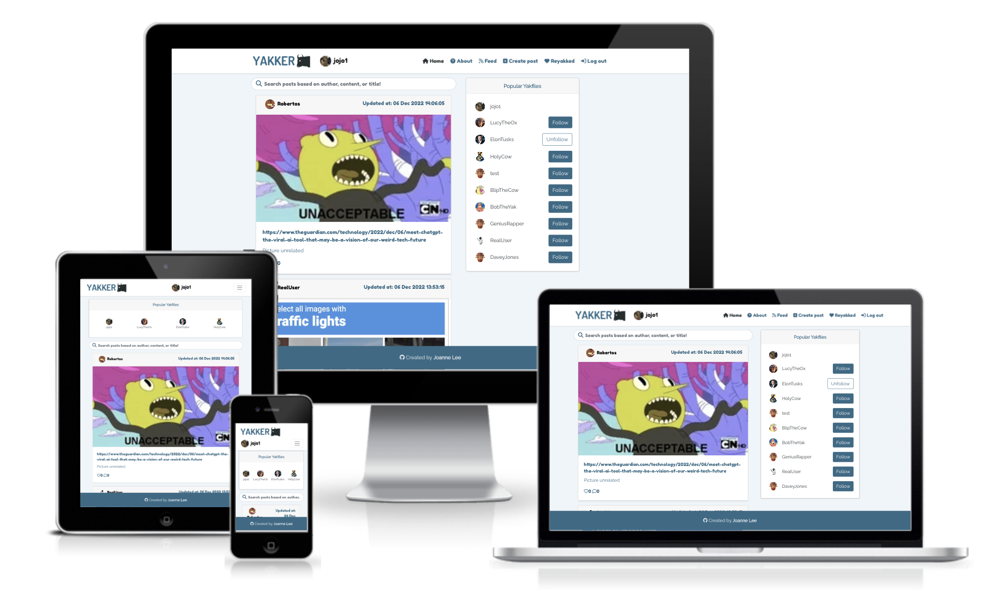

Yakker is a social-media website designed to mimic the features of Twitter. Users can create an account, log in, make a post, make comments on posts, like (reyakk) other users' posts and comments, and change their profile (yakfile) photo and profile biography. Yakker is designed to allow users to make posts about whatever they want, and be able to engage with other users by commenting on other posts/comments and reyakking to posts/comments. This repository contains the front-end of Yakker, created with HTML, CSS, Bootstrap, and React. 

`'yakfile' = 'profile'`

`'reyakk' = 'like'`

## Deployed Link

- [Yakker Front-End Deployed Link](https://yakker-front-end.herokuapp.com/)

## Back End Links

- [Yakker Back End Deployed Link](https://yakker-backend.herokuapp.com/)
- [Yakker Back End GitHub](https://github.com/lee-joanne/yakker-backend)

## User Experience (UX)

### User Stories

- Users: 

    - Authentication

    1. As a **user** I can **easily log in** so that **I can quickly post, add more comments, or delete content if I wish.**

    2. As a **user** I can **easily log out** so that **I can have more security on my account.**

    3. As a **user** I can **sign up easily with just a username and password** so that **I have the ability to create posts or comments without having to share my email address.**

    4. As a **user** I **cannot edit/delete posts/comments/likes that are not mine** so that **I can be assured that my posts/comments/likes are protected and can only be changed by me.**

    5. As a **user** I can **only like/unlike other users' posts and comments** so that **I can only show my appreciation for other posts/comments and not cheat the system by liking my own posts/comments.**

    6. As a **user** I can **only follow other users** so that **I cannot cheat the system and follow myself and gain myself a new, false follower.**

    7. As a **user** I can **see whether I am logged in or not** so that **I will know if I will need to log in if I am not.**

    8. As a **user** I can **maintain my logged-in status** so that **I will not need to constantly log in when not on the website for a few hours, and can log out manually whenever I want to log out.**

    - Posts

    1. As a **user** I can **create new posts** so that **I can share images, my thoughts, or what I'm doing.**

    2. As a **user** I can **edit posts** so that **I can change my posts, images, etc whenever I change my mind about what I posted or wish to remove/add details.**

    3. As a **user** I can **delete my posts** so that **I can get rid of my posts that I no longer want to be shared.**

    4. As a **user** I can **view the details of a post** so that **I can read more information about the post such as when it was created, who created it, if it was edited, read the comments, etc.**

    5. As a **user** I can **like posts** so that **I can share my appreciation for the post and show the world and the author that their post is great.**

    6. As a **user** I can **remove likes on a post** so that **I can change my mind about whether I like the post or not.**

    - Comments

    1. As a **user** I can **post a comment on a post** so that **I can contribute discussion to a post or share my thoughts about a post.**

    2. As a **user** I can **delete my comments on a post** so that **I can remove comments if I no longer want my comments to be public.**

    3. As a **user** I can **read comments on a post** so that **I can read what others think about the post and read the discussion happening.**

    4. As a **user** I can **edit my comments** so that **have the possibility to remove or add more details to my existing comments.**

    5. As a **user** I can **like comments** so that **I can share my appreciation for the comment.**

    6. As a **user** I can **unlike comments** so that **I can change my mind about my positive feelings towards a comment.**

    - Navigation

    1. As a **user** I can **a nice 500 page consistent with the site layout** so that **I can be communicated with if there are issues with the website's server or backend.**

    2. As a **user** I can **have the navigation bar customed to my logged-in or out status** so that **I can have the options to log in or sign up when logged out, or have the options to create a post, view my profile, sign out, etc when logged in.**

    3. As a **user** I can **a nice 404 page consistent with the site layout** so that **I can be communicated with if I have reached an invalid web page.**

    4. As a **user** I can **navigate through pages quickly** so that **I can view content smoothly without the pages being refreshed**

    5. As a **user** I can **see the navigation bar at the top of every page** so that **I can easily navigate between pages.**

    6. As a **user** I can **infinitely scroll down to see more posts and also to see more comments** so that **I can consistently look at more posts/comments without having to click any extra links to view more.**

    - Profile

    1. As a **user** I can **view user avatars** so that **easily identify users of the website.**

    2. As a **user** I can **view a detailed page of users** so that **I can see their posts and learn more about the user. I can also see their following count, followers count, etc.**

    3. As a **user** I can **follow or unfollow other users** so that **I can see or choose to remove posts by specific users in my posts feed.**

    4. As a **user** I can **see the most followed profiles** so that **I will be able to see who the most popular profiles are.**

    - General

    1. As a **user** I can **search for posts or users in a search box** so that **I can quickly find specific posts or users that I am wanting to look for.**

    2. As a **user** I can **easily find the 'About' link in the nav bar** so that **I can learn about the purpose of this website which will be crucial as a new user coming to the website.**

### Site Goals

- The goal of the website is to serve as a social media platform for all ages of different users. Users should be able to create an account without an email address to not compromise their personal data. Users are able to create accounts, log in, post whatever they wish with a title, content, and image, make comments on other users' posts, and reyakk (like) other users' posts and comments. Users also have the freedom to personalize their yakfile (profile) by adding their own yakfile display photo and changing their 'about me' section. Users have the freedom to edit and delete their posts and comments. A site like this is needed because, today, security is a huge issue. Making a social media account with Twitter, Facebook, Reddit typically asks for your email address and you would have to give away personal information. With Yakker, there are no ties to you and your personal life. You create an account, post anonymously and of your free will, and continue living your secure life. 

### Kanban Board and MosCow Prioritization

I used a kanban board to help organize the user stories and tasks required for this project. When each task was in progress, they would be dragged to the 'in progress' column. When they were completed, they were dragged to the 'done' column. I also utilized MoSCoW prioritization by labelling each task as either Must Have or Should Have. I prioritized finishing the Must Have tasks first and then worked on the Should Have tasks. I managed to complete all of the tasks in the end and all user stories are successfully covered.

Screenshot of Kanban Board Part 1

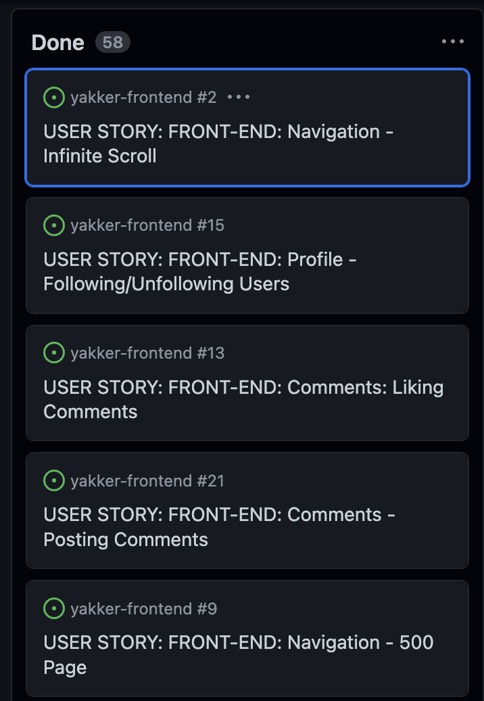

Screenshot of Kanban Board Part 2

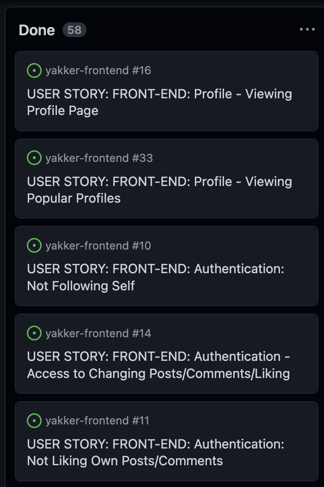

Screenshot of Kanban Board Part 3

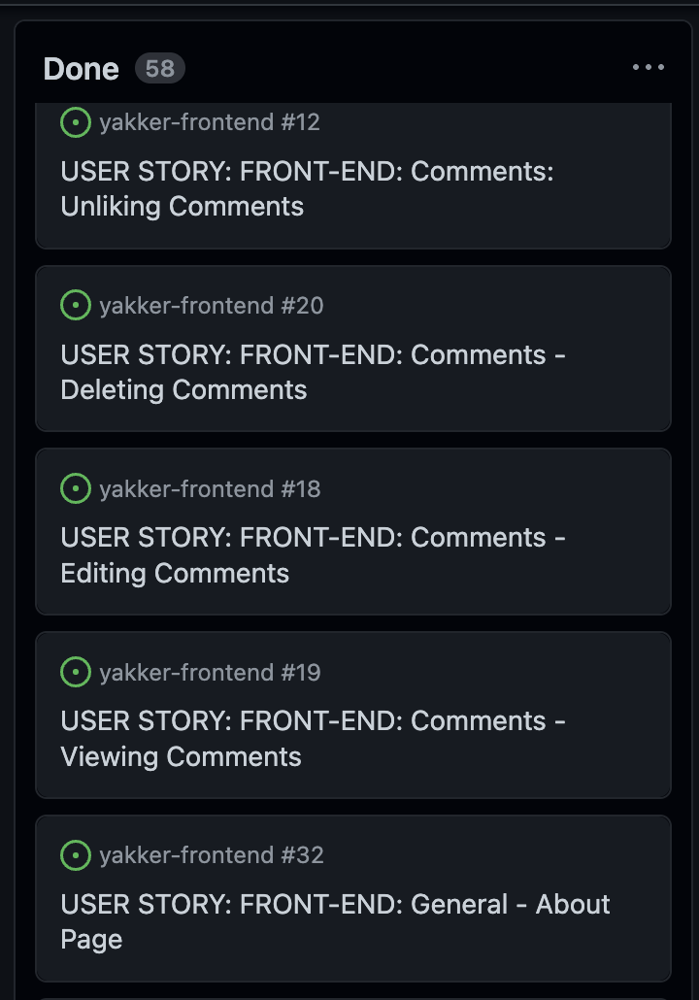

Screenshot of Kanban Board Part 4

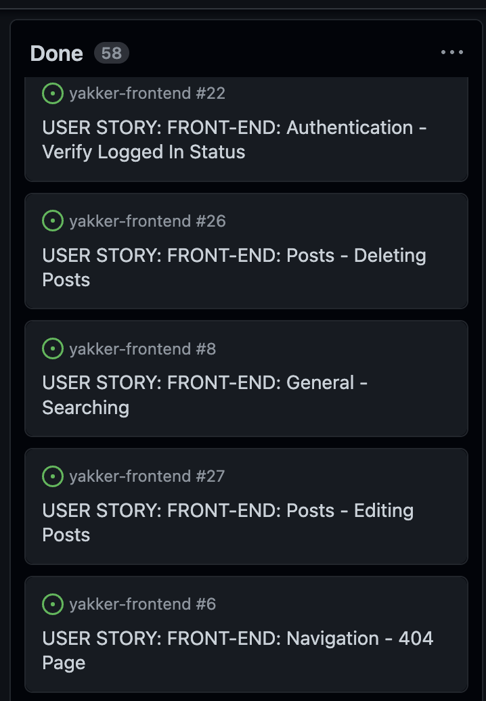

Screenshot of Kanban Board Part 5

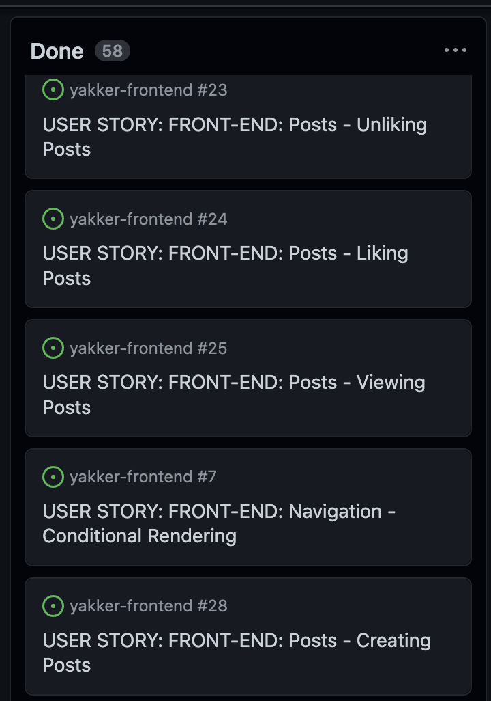

Screenshot of Kanban Board Part 6

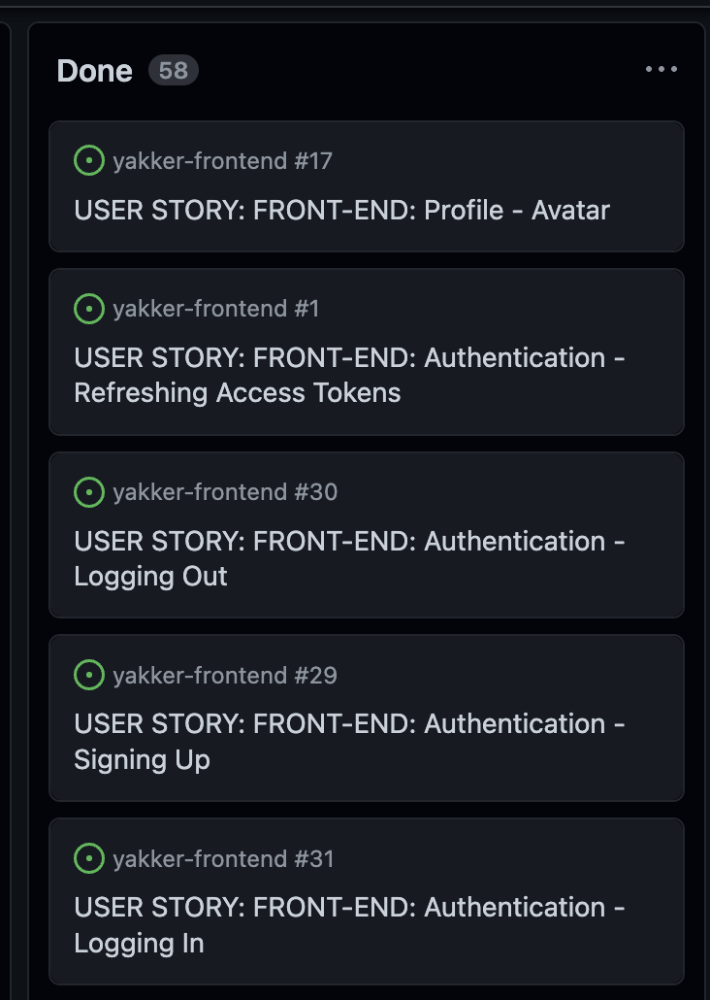

Screenshot of MoSCoW Prioritization Part 1

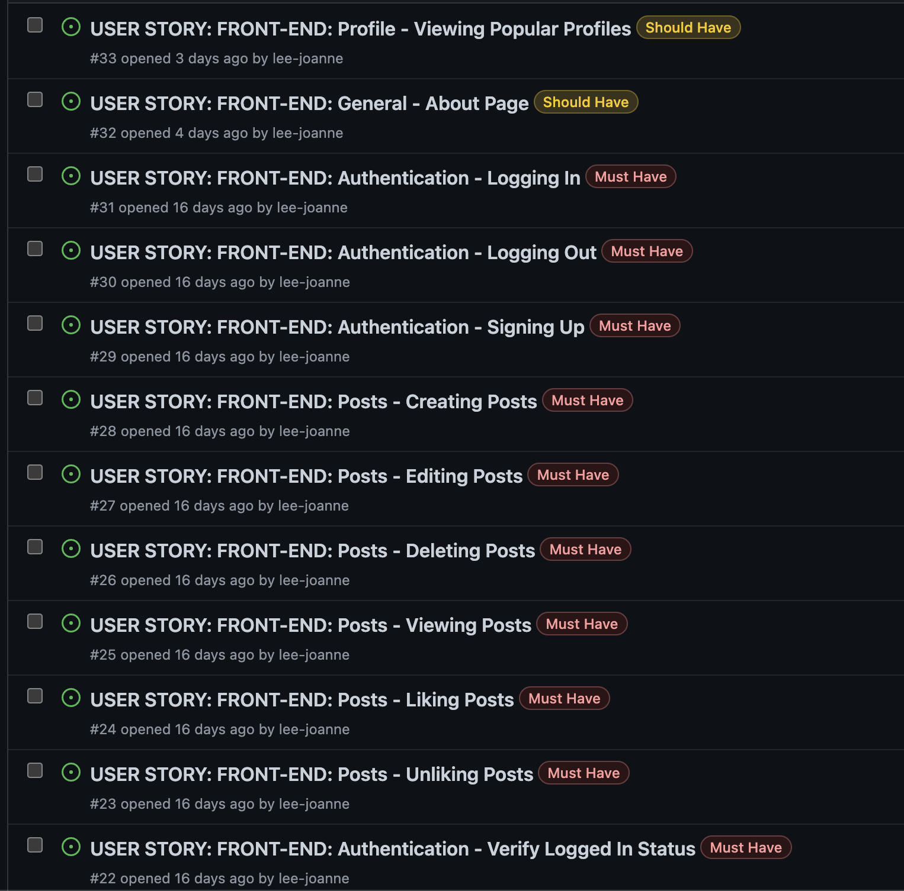

Screenshot of MoSCoW Prioritization Part 2

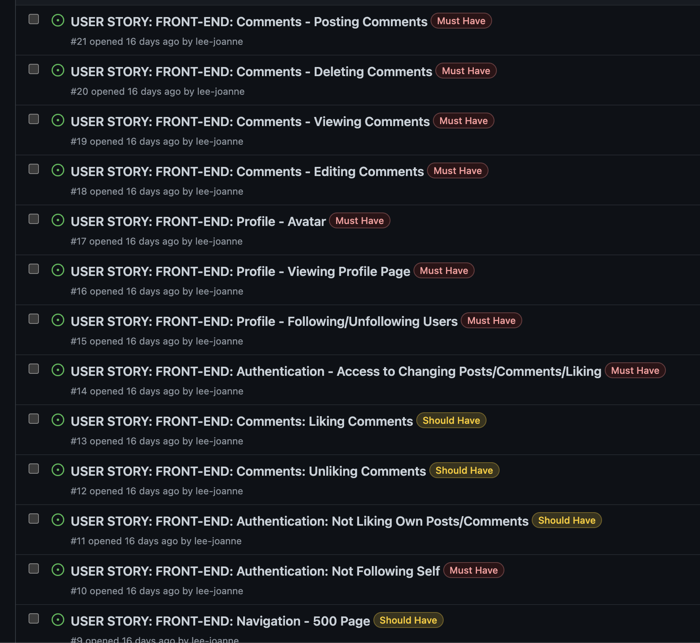

Screenshot of MoSCoW Prioritization Part 3

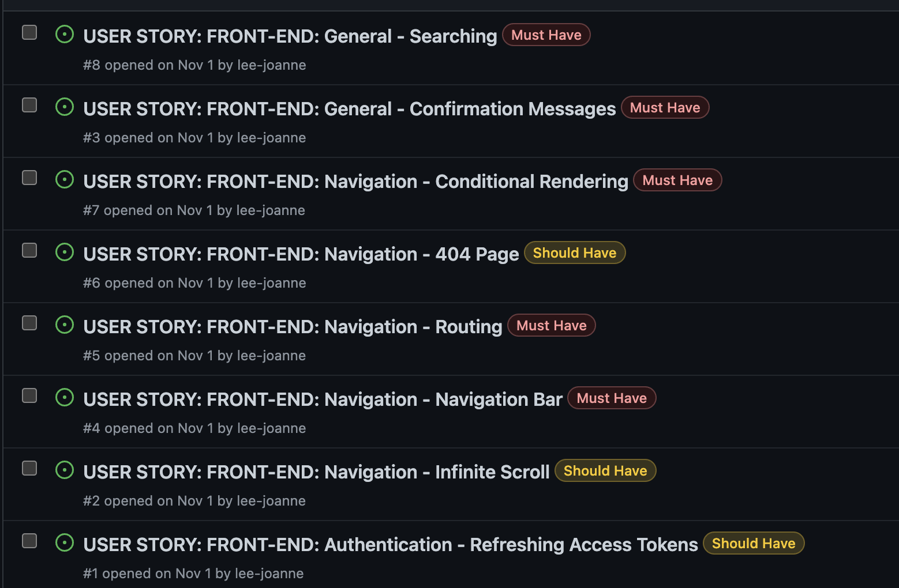

### Design

- Colour Scheme:

    - Typography: The fonts are taken from [Google Fonts](https://fonts.google.com/about).

        1. 'Fredoka One', cursive; is used as the primary text for this project. This font is used for headers, post titles, comments, navigation bar, etc. This font is used to help with information hierarchy on what texts of the project are most important. This font is chosen because it is fun and modern and suits the vibe of the social media platform.
        2. 'Raleway', sans-serif; is used as a secondary text for this project. This font is used for the post content, popular yakfile usernames to follow, user yakfile detailed section (about me, number of posts, number of followers, the number following), etc. It is selected for it's simplistic look to help enhance readability on longer paragraphs of text, hence why it is used for post content. 

    - Colors: The colours I have used for this website are outlined in the screenshot below. This colour scheme was developed by[Logo.com](https://logo.com/homepage). The primary colour was mainly used for text, the secondary colour was mainly used for when links or buttons are being hovered for contrast, and the accent was used for some text such as the username of the current logged-in user and which link in the navigation bar is active.

     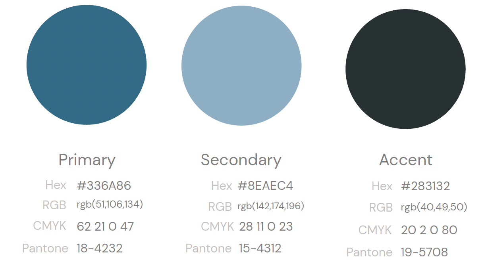

    - Logo: The logo is created using [Logo.com](https://logo.com/homepage). The colour scheme of the logo matches the rest of the website. 

    

### Wireframes

- Wireframes have been created using the program Whimsical

Website Feed:

Screenshot of Desktop Wireframe: Website Feed

Screenshot of Desktop Logged Out Wireframe: Website Feed

Screenshot of Mobile Wireframe: Website Feed

Screenshot of Tablet Wireframe: Website Feed

Create Post: 

Screenshot of Desktop Wireframe: Create Post

Screenshot of Mobile Wireframe: Create Post

Screenshot of Tablet Wireframe: Create Post

Post Detailed View:

Screenshot of Desktop Wireframe: Post Detailed View

Screenshot of Mobile Wireframe: Post Detailed View

Screenshot of Tablet Wireframe: Post Detailed View

Profile Page:

Screenshot of Desktop Wireframe: Profile Page

Screenshot of Mobile Wireframe: Profile Page

Screenshot of Tablet Wireframe: Profile Page

## Features

### Existing Features

- Navigation Bar

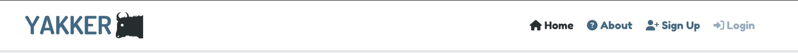

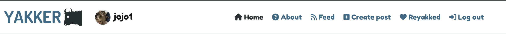

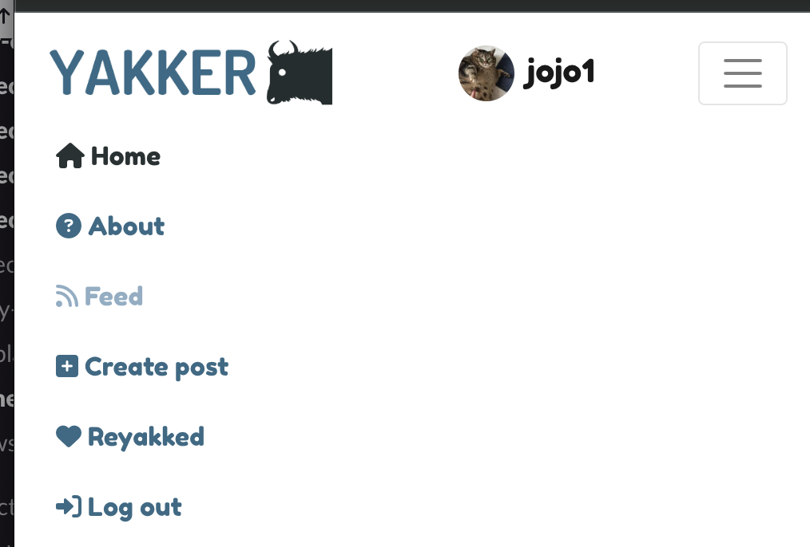

The navigation bar is created with React Bootstrap. Conditional rendering is used to see whether the user is logged-in or not. Depending on the logged in status, different links will appear. When the user is logged out, the user will see the option to log in, signup, and to read the 'About' of the website. When the user logs in, the user is able to see their username at the top of the screen (when clicking on it, user will be directed to their detailed page where they can edit their details), the option to go to 'Feed' (see all posts by their followed users), create a post, go to 'Reyakked' (see posts they have liked), and log out. The navigation bar is fixed at the top so it will always remain readily available when users scroll down the website. The pages are wired using React Router Dom so the navigation process is extremely quick. The active link will be black in contrast to the other links so the user knows exactly which page they are on. The navigation bar is fully responsive as it collapses into a hamburger icon on smaller screens. Users can easily log out of the website by clicking the 'Log Out' link that appears when users are signed in. 

User stories covered: 

1. As a **user** I can **see whether I am logged in or not** so that **I will know if I will need to log in if I am not.**

2. As a **user** I can **have the navigation bar customed to my logged-in or out status** so that **I can have the options to log in or sign up when logged out, or have the options to create a post, view my profile, sign out, etc when logged in.**

3. As a **user** I can **navigate through pages quickly** so that **I can view content smoothly without the pages being refreshed**

4. As a **user** I can **see the navigation bar at the top of every page** so that **I can easily navigate between pages.**

5. As a **user** I can **easily find the 'About' link in the nav bar** so that **I can learn about the purpose of this website which will be crucial as a new user coming to the website.**

6. As a **user** I can **easily log out** so that **I can have more security on my account.**

- About Page

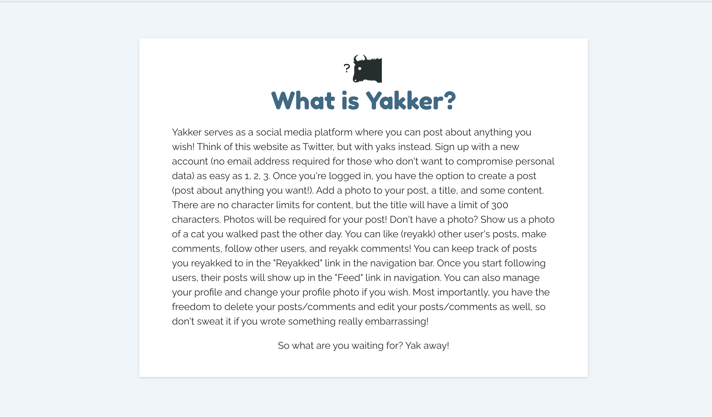

The 'About' page is created so new users will immediately be able to learn the purpose of Yakker and what Yakker is used for. The 'About' page also explains the different terms (yakfile for profile, reyakk for like). For logged-in users, the 'About' page serves a useful purpose as it explains what the Feed page is for, and what the Reyakked page is for. Users will be reminded of the functionality of the website such as the capability of being able to edit/delete posts and comments, not being able to reyakk to their own posts/comments, the character limit of titles and content, etc. All of the information a new user or returning user would possibly need will be found on this page.

User stories covered: 

1. As a **user** I can **easily find the 'About' link in the nav bar** so that **I can learn about the purpose of this website which will be crucial as a new user coming to the website.**

- Login/Sign up Page:

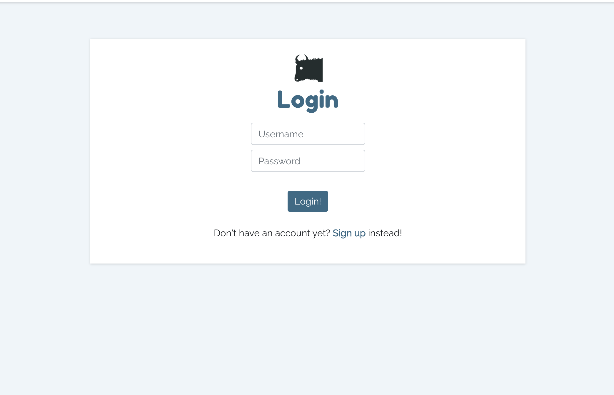

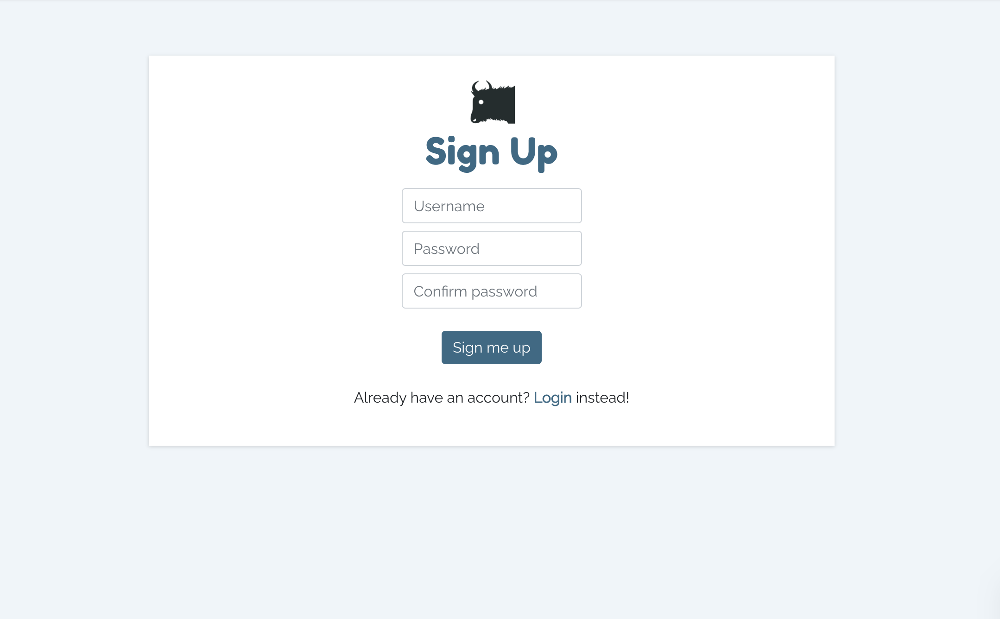

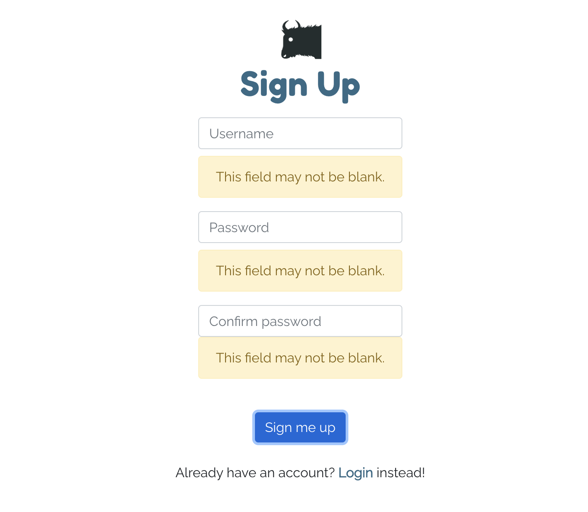

The login page and sign-up page are two separate pages where users can log in with an existing account or create a new account. The authentication and account creation is handled in the back end using Django all-auth. Form validation is in place on the sign-up page where all fields are required. Form validation is also in place where the user must put in the same password twice when confirming the creation of their password. An email address is not required for signing up, which is a very important feature of Yakker as we want our users to feel protected. When users are logged in, their logged-in status will remain for twenty-four hours thanks to axios intereceptors. The users will not have to constantly log back in when being away from the website for a few hours, which greatly enhances user experience and will keep users more engaged. If a logged-in user tries to access the sign-up or log-in pages, they will be automatically redirected to homepage. 

User stories covered: 

1. As a **user** I can **easily log in** so that **I can quickly post, add more comments, or delete content if I wish.**

2. As a **user** I can **sign up easily with just a username and password** so that **I have the ability to create posts or comments without having to share my email address.**

3. As a **user** I can **maintain my logged-in status** so that **I will not need to constantly log in when not on the website for a few hours, and can log out manually whenever I want to log out.**

- 404 Page:

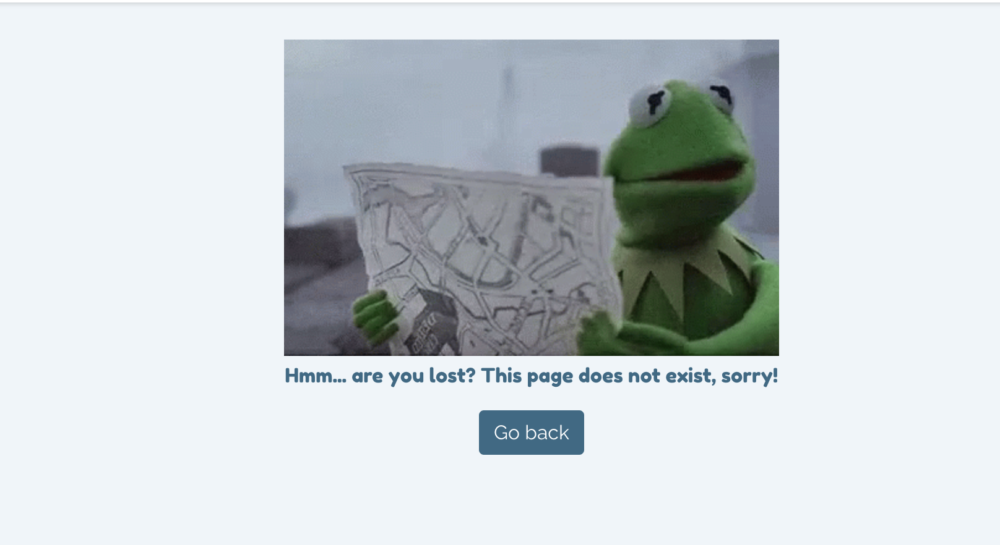

If the user accesses a url that does not exist, the user will be automatically redirected to a 404 page with a gif of Kermit the Frog. The user will always reach this page when typing in an invalid url within the Yakker domain, thanks to React Router Dom's routes. 

User stories covered:

1. As a **user** I can **a nice 404 page consistent with the site layout** so that **I can be communicated with if I have reached an invalid web page.**

- 500 Page:

Nothing is perfect, and nothing will run smoothly forever. That's why it is very important to create a 500 page for if there are ever problems with the server or back end. Users deserve to have a good, custom-made webpage to be redirected to if there's a problem with our end. That's why I have created a custom 500 page for if the server or back end ever has any issues, they will be redirected here. I have added navigation to this 500 page in the catch(err) portion of async functions throughout the project. 

User stories covered:

1. As a **user** I can **a nice 500 page consistent with the site layout** so that **I can be communicated with if there are issues with the website's server or backend.**

- Homepage

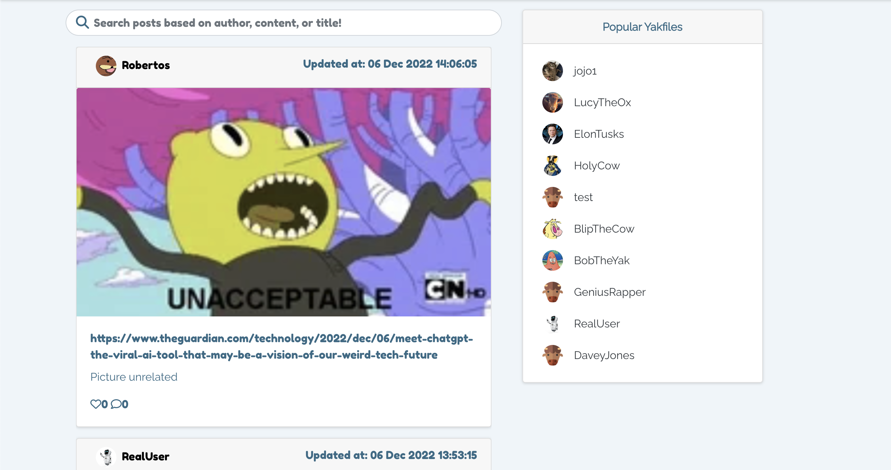

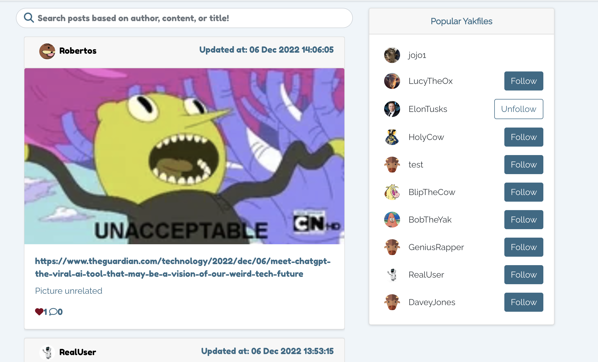

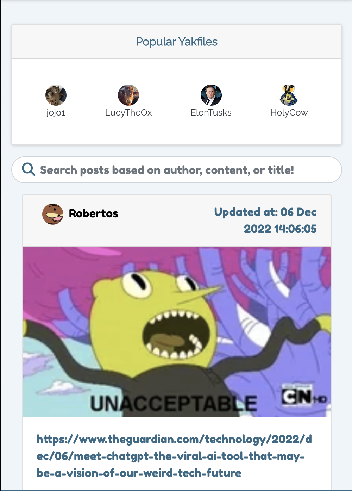

On the homepage of the website, the list of posts will be visible. Users will be able to browse all posted posts (newest first) and be able to see how many reyakks or comments each post has. Users can see who posted each post (with the avatar included), the date of each post, the photo, title, and content of each post. Users will be able to access the author's profile page by clicking on the avatar and username of the posted author. Users will be directed to a detailed view of the page when clicking on the post title. 
There is also a search bar at the top, where users are able to search posts based on content, title, and author. This will help users to be able to search for specific posts they are looking for or posts by a specific author. Logged-in users will be able to see 'edit' and 'delete' icons on their own posts and will be able to access these links from the homepage. When users click the 'delete; icon, the post will be deleted. Users will only be able to delete their own posts. The functionality of post-editing will be discussed later. Logged-in users will be able to reyakk/unreyakk to other users' posts by clicking on the heart that is available. Functionality on post reyakks will be discussed later. 
Users will be able to see the most popular Yakfiles on the right-hand side of larger screens, and at the top of the page on smaller screens. The popular yakfiles will be listed with their avatar and username. The usernames and avatars are clickable and will redirect users to their profile page. Popular yakfiles will be present on all pages except for the 'About', 'Sign Up', 'Create Post', and 'Log in' pages. Logged in users will be able to view the option to follow/unfollow other users. The follow functionality will be touched in the 'Follower' section. 
Infinite scroll is incorporated in the homepage to allow users to be able to scroll to view posts without having to navigate back and forth pages to see more posts. This enhances user experience greatly as users will be able to stay more engaged with the website without having to click extra links.

User stories covered:

1. As a **user** I can **view user avatars** so that **easily identify users of the website.**

2. As a **user** I can **see the most followed profiles** so that **I will be able to see who the most popular profiles are.**

3. As a **user** I can **search for posts or users in a search box** so that **I can quickly find specific posts or users that I am wanting to look for.**

4. As a **user** I can **infinitely scroll down to see more posts and also to see more comments** so that **I can consistently look at more posts/comments without having to click any extra links to view more.**

5. As a **user** I can **edit posts** so that **I can change my posts, images, etc whenever I change my mind about what I posted or wish to remove/add details.**

6. As a **user** I can **delete my posts** so that **I can get rid of my posts that I no longer want to be shared.**

7. As a **user** I can **like posts** so that **I can share my appreciation for the post and show the world and the author that their post is great.**

8. As a **user** I can **remove likes on a post** so that **I can change my mind about whether I like the post or not.**

9. As a **user** I can **follow or unfollow other users** so that **I can see or choose to remove posts by specific users in my posts feed.**

10. As a **user** I **cannot edit/delete posts/comments/likes that are not mine** so that **I can be assured that my posts/comments/likes are protected and can only be changed by me.**

- Footer

A footer is fixed at the bottom of all pages that is consistent with the styling of the website. The footer is always available so users can see who the creator of this website is. The user is able to go to their GitHub which opens in a separate tab. 

- Detailed Post Page (Minus Comments Section) / Editing Posts

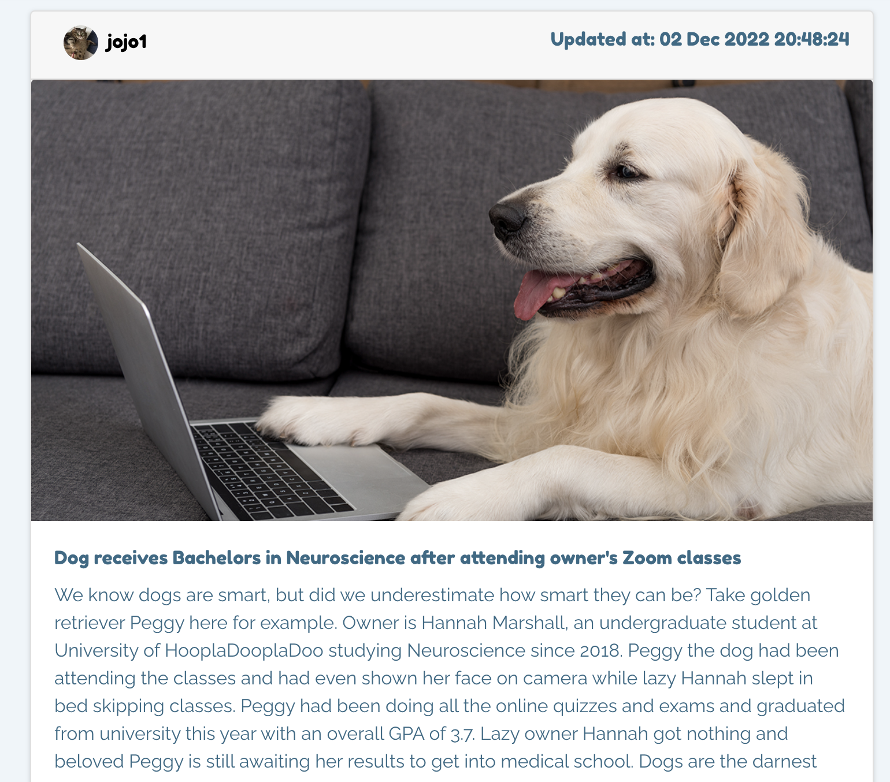

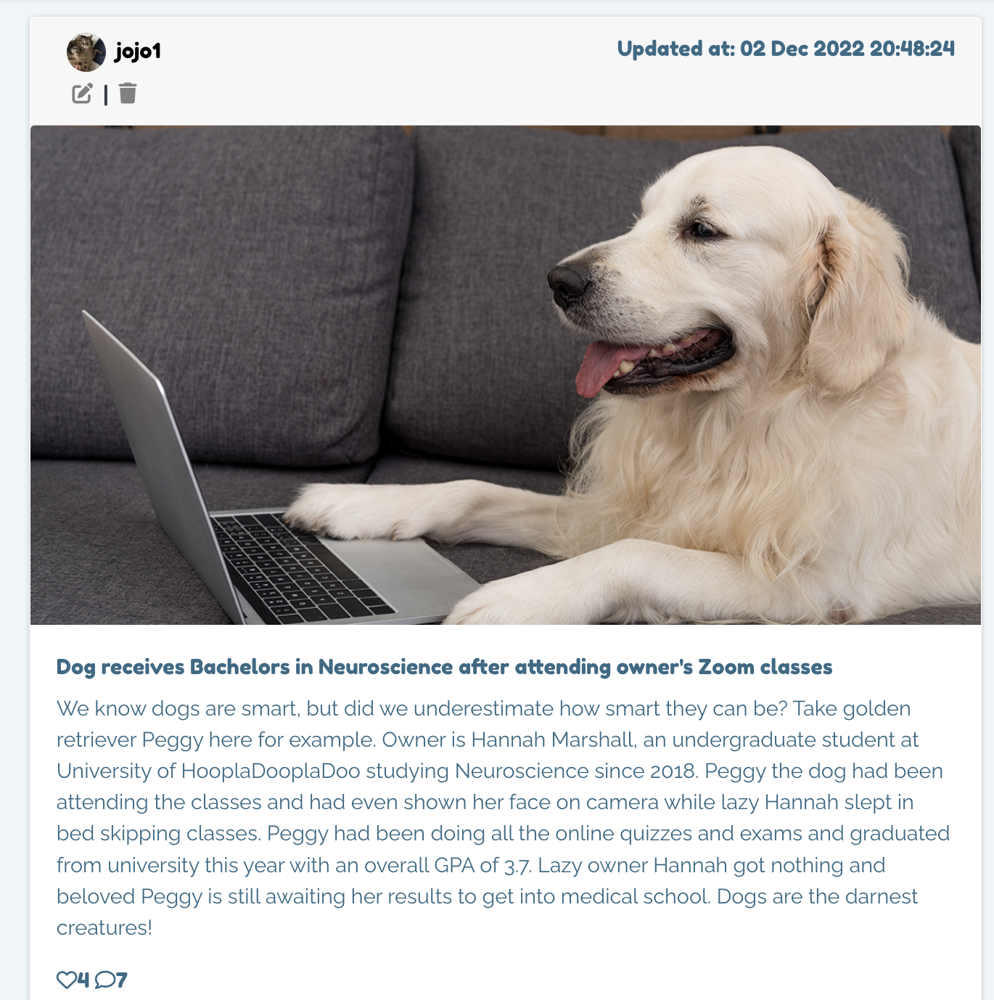

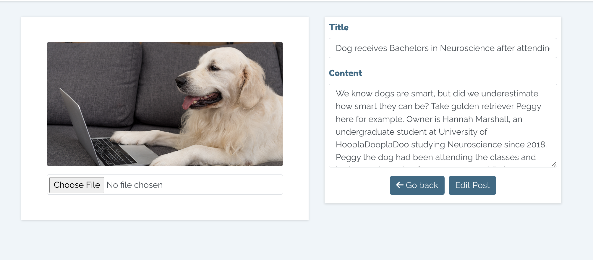

When clicking on the title of the post on the homepage, users will be redirected to the detailed view of the post. Here, users will be able to scroll down and view all comments posted on the post. The functionality of comments will be discussed later. The author of the post will be able to view the 'edit' and 'delete' icons at the top of the post. When clicking 'edit', users will be redirected to the edit link where the form is pre-populated with the contents. Users will be able to change their post, including changing the image if they wish, and save. If they wish to cancel, they will be redirected to the previous link (editing the post is also accessible from homepage when the user sees a post they have posted). Users will be able to reyakk and unreyakk to user posts from here by clicking on the hearts. Further functionality on post reyakks will be discussed later. Users will only be able to edit their own posts. If a different user tries to tamper with the url to edit another user's post, they will be redirected to the homepage. 

User stories covered:

1. As a **user** I can **edit posts** so that **I can change my posts, images, etc whenever I change my mind about what I posted or wish to remove/add details.**

2. As a **user** I can **delete my posts** so that **I can get rid of my posts that I no longer want to be shared.**

3. As a **user** I can **view the details of a post** so that **I can read more information about the post such as when it was created, who created it, if it was edited, read the comments, etc.**

4. As a **user** I can **like posts** so that **I can share my appreciation for the post and show the world and the author that their post is great.**

5. As a **user** I can **remove likes on a post** so that **I can change my mind about whether I like the post or not.**

6. As a **user** I **cannot edit/delete posts/comments/likes that are not mine** so that **I can be assured that my posts/comments/likes are protected and can only be changed by me.**

7. As a **user** I can **view user avatars** so that **easily identify users of the website.**

- Full Functionality of Comments Section

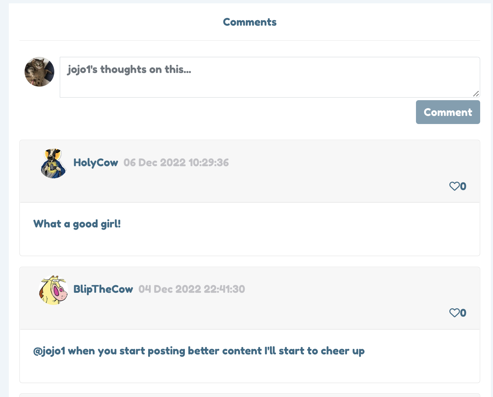

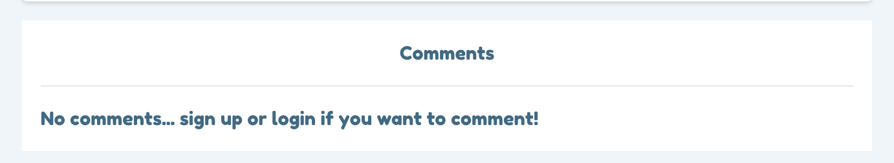

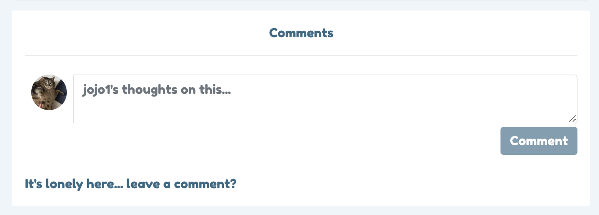

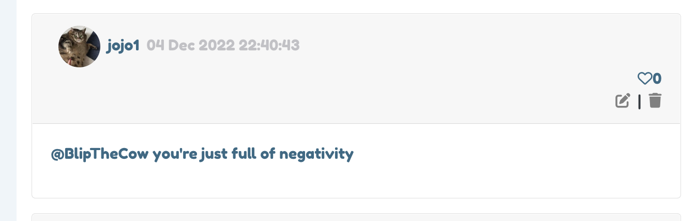

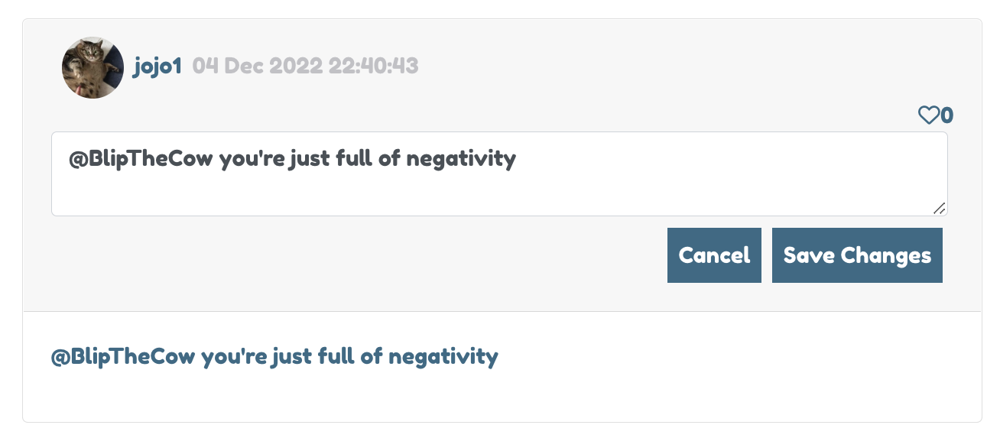

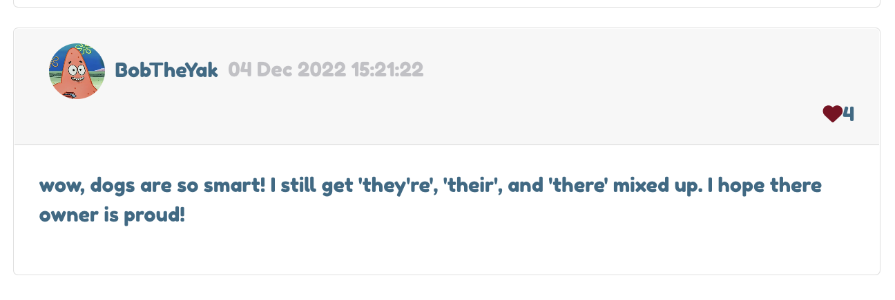

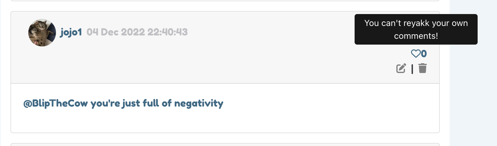

All comments (newest first) on a specific post are viewed on the detailed view of the post. The comments will show the username, the date of the comment, how many reyakks the comment has, and the avatar of the user. Depending on users' logged-in status and whether comments are already available or not, different messages will appear. If there are no comments and the user is logged out, the comment section will encourage the user to log in or sign up to comment. If there are no comments and the user is logged in, the comment section will encourage the user to comment. Logged-in users will be able to post a comment and add their content. Authors of the comment will be able to view the 'edit' and 'delete' icons. When clicking 'delete', the user's comment will be immediately deleted. When 'edit' is clicked, users can change their comments with the content pre-populated. Users will be able to reyakk or unreyakk to other users' comments. If the author tries to reyakk to their own comment, a message will show stating that they are not able to. The comment section has infinite scroll incorporated so users will be able to stay engaged to the comments without having to click extra navigation buttons. Users can click on the avatar or username of the commenter and be directed to their profile page. Users will only be able to delete and edit their own comments. 

User stories covered:

1. As a **user** I can **only like/unlike other users' posts and comments** so that **I can only show my appreciation for other posts/comments and not cheat the system by liking my own posts/comments.**

2. As a **user** I can **post a comment on a post** so that **I can contribute discussion to a post or share my thoughts about a post.**

3. As a **user** I can **delete my comments on a post** so that **I can remove comments if I no longer want my comments to be public.**

4. As a **user** I can **read comments on a post** so that **I can read what others think about the post and read the discussion happening.**

5. As a **user** I can **edit my comments** so that **have the possibility to remove or add more details to my existing comments.**

6. As a **user** I can **like comments** so that **I can share my appreciation for the comment.**

7. As a **user** I can **unlike comments** so that **I can change my mind about my positive feelings towards a comment.**

8. As a **user** I can **infinitely scroll down to see more posts and also to see more comments** so that **I can consistently look at more posts/comments without having to click any extra links to view more.**

9. As a **user** I can **view user avatars** so that **easily identify users of the website.**

10. As a **user** I **cannot edit/delete posts/comments/likes that are not mine** so that **I can be assured that my posts/comments/likes are protected and can only be changed by me.**

- Post Reyakks

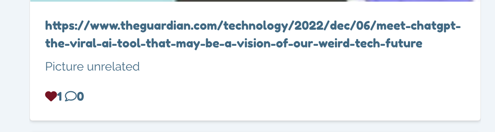

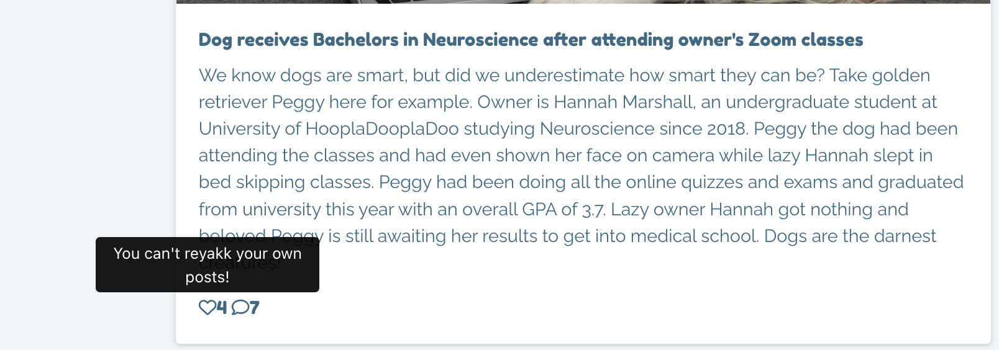

Logged-in users will be able reyakk to other users' posts. Reyakking and unreyakking to other users' posts can be done from the homepage or detailed post view. Users can reyakk to posts by clicking on the heart icon, which will turn red when reyakked. If the user clicks on the heart icon again, it will be unreyakked and go back to a colourless heart. If users try to reyakk to their own posts, a message will pop up stating that users cannot reyakk to their own posts. 
Users will be able to access all the posts that they have reyakked to in the "Reyakked" link in nav bar.

User stories covered:

1. As a **user** I can **only like/unlike other users' posts and comments** so that **I can only show my appreciation for other posts/comments and not cheat the system by liking my own posts/comments.**

2. As a **user** I can **like posts** so that **I can share my appreciation for the post and show the world and the author that their post is great.**

3. As a **user** I can **remove likes on a post** so that **I can change my mind about whether I like the post or not.**

- Create Post Page

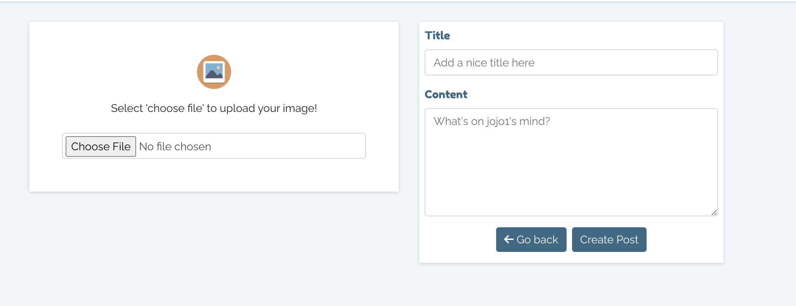

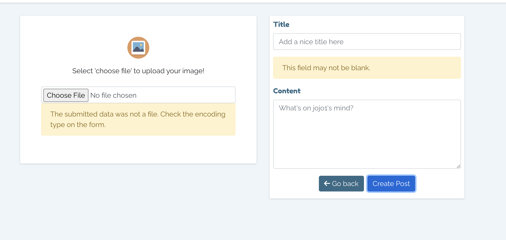

Logged-in users will be able to create posts by clicking on the 'Create Post' icon in the nav bar. If logged-out users try to access this url, they will automatically be redirected to homepage. On the Create Post page, users will be able to add their image, add a title, and add content. If the user tries to submit the form without adding a photo or title, messages will show to the user explaining the issue. The image upload will only accept image files, and images smaller than 2500px in width and in height, and less than 1MB thanks to the back end set-up for posts. 

User stories covered:

1. As a **user** I can **create new posts** so that **I can share images, my thoughts, or what I'm doing.**

- Follower

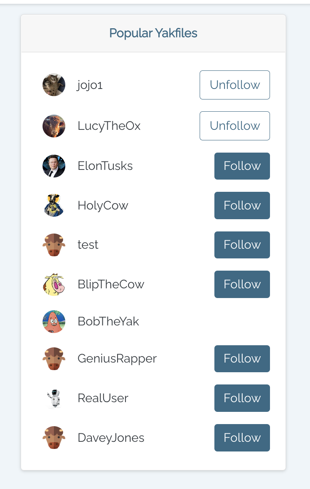

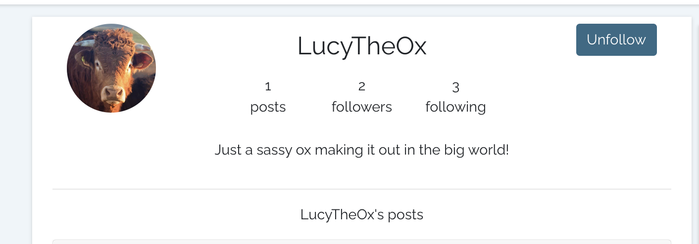

Logged-in users will have the functionality of being able to follow other users. In the screenshot above, the user is logged in as BobTheYak. The user will not have the follow button available for BobTheYak as users will not be able to follow themselves. If the user is NOT following a user already, a 'Follow' button will pop up beside usernames. If the user IS following a user already, an 'Unfollow' button will appear instead. Users will be able to access following users from the Popular Yakfiles section, or in the detailed page of yakfiles. 
Users will be able to see all posts posted by their followed users in the "Feed" link in the navigation bar. 

User stories covered:

1. As a **user** I can **only follow other users** so that **I cannot cheat the system and follow myself and gain myself a new, false follower.**

2. As a **user** I can **follow or unfollow other users** so that **I can see or choose to remove posts by specific users in my posts feed.**

- Yakfile Page

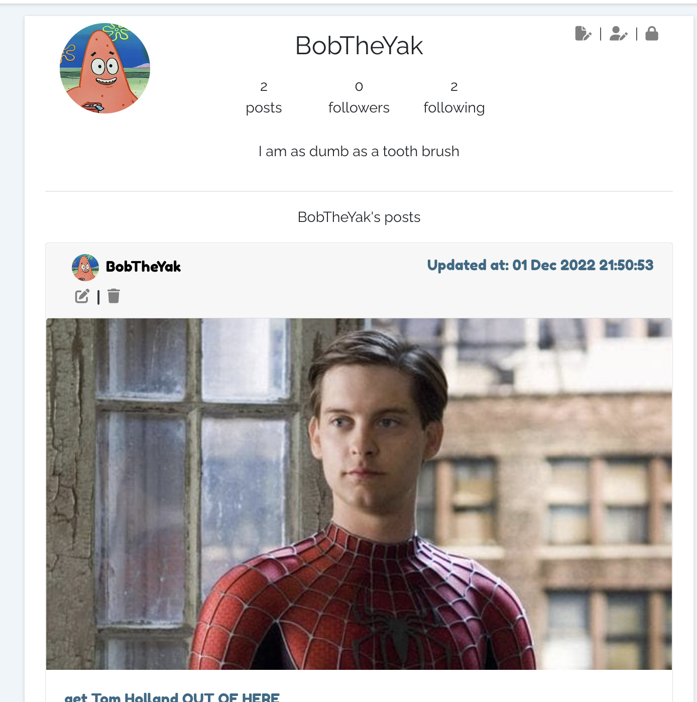

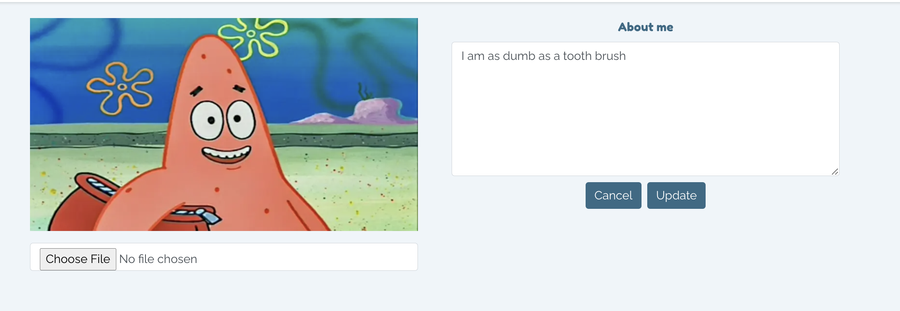

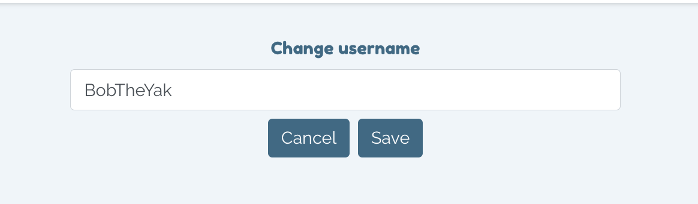

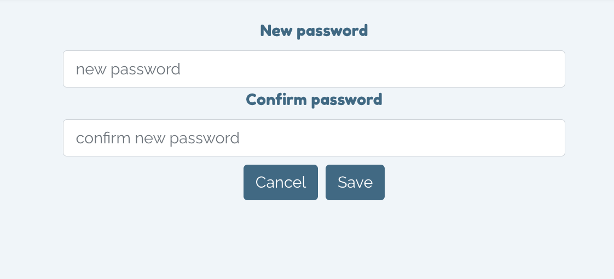

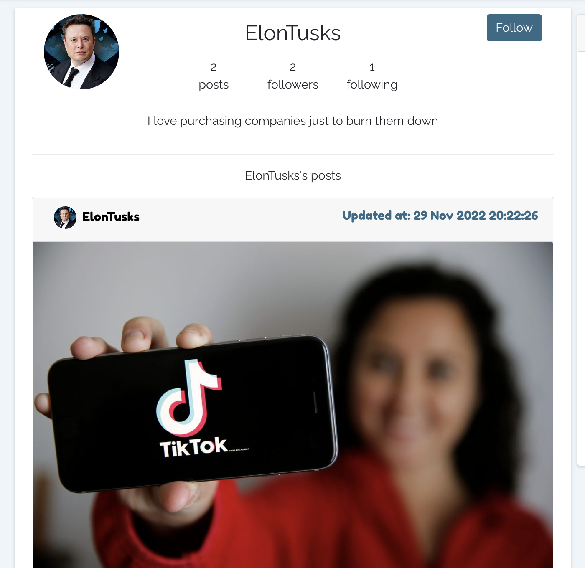

On the detailed yakfile page, users are able to view further details about the user such as how many followers they have, how many users they are following, and how many posts they have posted. Users are able to view all posts the speciifc user has posted, with infinite scroll incorporated. Users also have access to reyakk or unreyakk to other users' posts from detailed profile page. When the user views their own profile, they will see icons at the top right corner of being able to change their yakfile content, username or password. If the user wishes to change yakfile content, the fields are pre-populated where users can change their avatar photo or 'about me' section. When a user views the detailed yakfile page of another user, the top right corner is placed with a 'Follow' or 'Unfollow' button instead. 

User stories covered:

1. As a **user** I can **like posts** so that **I can share my appreciation for the post and show the world and the author that their post is great.**

2. As a **user** I can **remove likes on a post** so that **I can change my mind about whether I like the post or not.**

3. As a **user** I can **infinitely scroll down to see more posts and also to see more comments** so that **I can consistently look at more posts/comments without having to click any extra links to view more.**

4. As a **user** I can **view a detailed page of users** so that **I can see their posts and learn more about the user. I can also see their following count, followers count, etc.**

5. As a **user** I can **view user avatars** so that **easily identify users of the website.**

6. As a **user** I can **follow or unfollow other users** so that **I can see or choose to remove posts by specific users in my posts feed.**

### Future Features

- In the future, I would like to include the user's age in days as this is added as a serializer in the back end.
- In the future, I wish to include a feature where users can private message each other so users can stay more connected.
- In the future, I wish to include a feature where users can target specific users in their comments section by add '@'.
- In the future, I wish to include a feature where users can add images to their comments.
- In the future, I wish to include a feature where users can add a media file instead of an image file if they wish to share a video.

## Technologies Used

### Languages and Packages/Libraries Used

1. [React](https://reactjs.org/)

2. [HTML5](https://en.wikipedia.org/wiki/HTML5)

3. [CSS3](https://en.wikipedia.org/wiki/CSS)

4. [JavaScript](https://www.javascript.com/)

5. [React Bootstrap](https://react-bootstrap.github.io/)

### Programs Used

1. [Git](https://git-scm.com/)
    - Git was used by utilizing the Gitpod terminal to commit to Git and Push to GitHub. Version control. 

2. [GitHub](https://github.com/)
    - GitHub was used to store the project code after being pushed in by Git. Project repository linked with Heroku for deployment process. GitHub was also used to create the kanban board. 

3. [Heroku](https://dashboard.heroku.com/login)
    - Heroku was used to deploy this project. Heroku's Postgres was used as the database.  

4. [Whimsical](https://whimsical.com)
    - Whimsical was used to create the wireframes for the project. 

5. [ESLint](https://eslint.org/)
    - ESLint was used to check for errors and syntax of code. 

6. [W3C CSS Validator](https://jigsaw.w3.org/css-validator/)
    - W3C CSS validator used to check the CSS3 code.

7. [Ecotrust-Canada Markdown-toc](https://ecotrust-canada.github.io/markdown-toc/)
    - Ecotrust-Canada Markdown was used to create the table of contents for this README. 

8. [Axios](https://axios-http.com/)
    - Promise based http client for making http requests to the back end API

9. [Cloudinary](https://cloudinary.com/)
    - Cloudinary used to host the uploaded images.

10. [Font Awesome](https://fontawesome.com/)
    - Font Awesome was used for the Fredoka One and Raleway fonts. 

11. [Google Fonts](https://fonts.google.com/)
    - Google Fonts was used for the fonts.

12. [Favicon.io](https://favicon.io/)
    - Favicon.io was used for the favicon.

13. [Logo](https://logo.com/homepage)
    - Logo was used to create the logo for this website and to get the colour scheme.

14. [React Infinite Scroll](https://www.npmjs.com/package/react-infinite-scroll-component)
    - React infinite scroll was used for the infinite scroll capability of posts and comments. 

15. [React Router](https://v5.reactrouter.com/web/guides/philosophy)
    - React Router was used for crucial navigation of the website. 

## Testing

### Validation Testing

- ESlint was downloaded following the instructions [here (credit goes to Ian Meigh)](https://gist.github.com/ianmeigh/8e603b91a38d7829d959402bfcf29d3d). No errors were returned after running through all files (exceptions are node modules, reportWebVitals, setUpTests, json package files). The following rules were added for ESlint: 

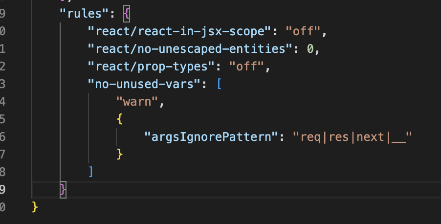

- [W3C CSS Validator](https://jigsaw.w3.org/css-validator/) was used to check CSS code, no errors were returned.

### Manual Testing

- Vigorous manual testing has taken place to test all functionality of the website to ensure everything is in working order. These tests were performed by creating multiple accounts and testing out different features. I have used different computers, I have bugged colleagues and friends to test out the website and create posts, etc. These are lists of results of the manual testing:

**Navigation Bar, Footer, and Authentication Tests**: 

- Navigation bar correctly shows "Home", "About", "Sign Up", and "Login" links at the top when the user is logged out.
- Navigation bar correctly shows "Home", "About", "Feed", "Create Post", "Reyakked", and "Log out" links at the top when the user is logged in. Navigation bar also shows current logged-in user's username and avatar at the top beside the logo.
- Logged-in users successfully get redirected to homepage when trying to access `/login` or `/signup` urls.
- Navigation bar correctly collapses in smaller screens into a hamburger icon and toggles correctly, and untoggles when user clicks away.
- Navigation bar is correctly fixed at the top of the page regardless of user scrolling.
- Footer is correctly fixed at the bottom fo the page regardless of user scrolling.
- External link in footer successfully opens in a new blank page. 
- When user is logged in, the "Feed" link will show posts by users they follow.
- When user is logged in, the "Reyakked" link will show all the posts the user reyakked. 
- Clicking log out will successfully log out the user, and users will know they are logged out as their username will no longer be at the top.
- If user logs in with incorrect details, they will be prompted with a message.
- If user tries to sign up with any fields missing, they will be prompted with a message that fields need to be added.
- If user tries to sign up with two different passwords, they will be prompted with a message that their passwords do not match.

**Homepage Tests**

- Infinite scroll successfully works as the page will load when more than ten posts are present.
- The lists of posts are all shown, with the author, date updated, author avatar, post title, image, content, number of reyakks and comments present.
- Author and avatar of posts are able clickable and will redirect user to profile page of that user.
- If user is logged out, hovering over reyakk button will prompt user to log in.
- If user is logged in and NOT the author of the post, user is able to hover over reyakk button and choose to reyakk or unreyakk.
- If user is logged in and IS the author of the post, a message will tell user they are not able to reyakk to their own posts.
- Number of reyakks on the post will update accordingly and in real-time. 
- All reyakked posts by a user will show up in the "Reyakked" link in navigation.
- Popular Yakfiles are present on the right side on larger screens, and present at the top on smaller screens as well as the bottom to follow users. Popular Yakfiles correctly update based on who has the highest number of followers. Each username is clickable and will direct user to the profile page of the desired user. 
- If users are logged in, the users they do not already follow will have a 'Follow' button beside the username in Popular Yakfiles.
- If users are logged in, the users that they do follow will have an 'Unfollow' button beside the username in Popular Yakfiles.
- Users are successfully able to search for posts based on content, title, and author. The search will take one second after the user stops typing before conducting the search. 
- When the page is loading (the posts, the Popular Yakfiles, or when they type in a search field), the Bootstrap spinner shows successfully.
- Homepage is fully responsive. 

**Post Tests**

- Logged-in users are able to click "Create Post" and be redirected to the `/post/create` url to create a post. Users will then be able to add an image, title, and content. 
- Correct validations will show if image field or title field is missing. If image uploaded is not an image, is larger than 2500px in height and in width and larger than 1MB, it will not accept it. If the user types in content larger than 300 characters in the title, an error message will show.
- Logged out users who try to access `/post/create` url will be redirected to homepage.
- Placeholder in post create content successfully shows the user's username.
- Created posts successfully show up on the homepage with the correct date, username, and content shown. The newest post will always be shown at the top of homepage. 
- Avatar and username of posts are clickable and will redirect user to the profile page.
- Titles of the posts are clickable and will redirect user to the detailed post page. The correct post will show according to the post id: `/post/{id}`.
- Reyakk functionality works exactly the same in detailed post view as well as homepage.
- Comments linked to the post will show in the detailed post page (Comment tests will be discussed next).
- Authors of the post can see the icon where they can choose to edit or delete their posts. Prompt messages will show as a ToolTip.
- Author posts are successfully deleted when author clicks delete.
- When author chooses to edit post, they will be redirected to the correct link with the post image, title, and content pre-populated in the form field. Users are able to change their post and have the changes saved successfully.
- Only authors of the post can edit their own posts. Any tampering with the urls will redirect other users to the homepage.

**Comment Tests**

- Posts with no comments will have a message that prompts the user to log in to leave a comment. If the user is logged in, it will prompt the user to leave a comement. If the user is logged out, it will prompt the user to login first.
- The comment field successfully shows the logged-in username in the content placeholder, as well as their avatar. 
- All comments on an associated post will be shown newest first. Infinite scroll works successfully as more than ten comments will load.
- Logged-in users will be able to reyakk to comments. 
- Logged-in users will be able to hover the reyakk icon where it will turn red. Comments will be successfully reyakked when clicked, or unreyakked when click. Immediate results will show. 
- If the author of the comment tries to reyakk to their own post, a message will show stating that users cannot reyakk to their own comments.
- If logged-out users try to reyakk to comments, a message will show stating to log in to reyakk to comments.
- Bootstrap spinner successfully shows when comments are being retrieved. 
- Number of comments on the post will update accordingly to the number of comments there are.
- Number of reyakks on the comment will update accordingly to the number of reyakks there are.
- Users are successfully able to delete their comments and edit their comments.
- Only authors of the comment can view the icons where they can edit or delete.
- Deleted comments are deleted immediately.
- Edited comments are pre-populated with the comment content. 

**Follower Tests**

- Logged-in users are successfully able to follow users. The amount of follows will update accordingly in detailed profile page.
- The amount of followers will update accordingly when a user is being followed by another user.
- In Popular Yakfiles and detailed profile page of other users, a "Follow" button will show up if the user is not following them already. An 'Unfollow' button will show up if the user is already following them. When clicking these buttons, number of follows/followers will update.
- Posts posted by followed users will show up in the "Feed" page.
- Popular Yakfiles will update accordingly based on who has the highest amount of followers, with the highest at the top of the list.
- Only logged-in users will view the option to follow or unfollow users.

**Yakfile Tests**

- Users are successfully able to access detailed profile urls of the username they click.
- Users will see a "Follow" button for users they do not follow, and 'Unfollow' for users they already follow.
- When users view their own profile page, they will see three icons where they can edit their profile, change username, or change password.
- When editing profile, user will be redirected to a link with their profile image and 'about me' pre-populated. Users are successfully able to edit their photo and 'about me' page.
- When changing username, users will be redirected to page where they can change their username. If user tries to change to username that already exists, user will be notified. When user changes username, the new username will be reflected on all associated posts, comments, etc.
- When changing passwords, users will be redirected to a page where they can change their password. Users can type in the password and confirm. If user types in unmatching passwords, a message will show saying that passwords do not match.
- Logged-out users will not see any button to click in detailed post page where the Follow/Unfollow/edit icons are.
- All posts by the user in their detailed profile page will show up. Infinite scroll successfully works where more than ten posts can show up at a time.
- Post reyakks functionality works the same when viewing posts in the detailed profile page of the user.
- Clicking on the title of the posts will still redirect user to the detailed post page of the post. 

**Other Testing**

- Any links within the domain that do not exist will redirect user to the 404 page.
- Any errors in the back end or server will redirect user to the 500 page. This was tested during the back end logout bug. 

### Bugs 

Many bugs have occurred during the development of the front end project. Most notable bugs are listed below:

- A feature to show alert messages to the user upon successful post creation, deletion, editing, comment creation, deletion, editing, etc would have been desirable to have. I have added a deleteStatus and setDeleteStatus useState hook to try to achieve this and to set whether the result is a success or not. If it was successful, I wanted to incorporate Bootstrap alerts to notify the user. However, since the user is being redirected to homepage after success, the renders in the file would not be showing since the user is being sent to another page. I was trying to figure this out with creating a custom context or by transferring the state, but it became too complicated and did not want to risk jeopardizing the project. In the future, I wish to add this feature so users will always be communicated when their actions are successful. 

- In the beginning, I was having issues with using ES6 JavaScript features such as optional chaining, destructing, the spread operator, etc. I was trying to write vanilla code in lieu of these ES6 JavaScript features but it was too time-consuming and did not show good developer skills. After trying to figure out what was going on, Tutor Support was able to point out that I was running on React scripts version 2 and that I had to update to the latest version. After updating, ES6 features were working well.

- I have downloaded the latest version of React Router (v6) and useHistory and Switch were no longer used in v6. I was wondering why the syntax wasn't working as per the CI Example Project and read up on the documentation on the new v6 changes. UseHistory was now useNavigate, and Switch was now Routes. I was able to change the syntax accordingly throughout the site to match v6.

- There were many issues related to typos, unfortunately. When creating the code for users to reyakk to comments, I kept getting an error in the console that a key had to be assigned, and no key was assigned in DetailPostPage.js where comments are passed over. However, comments indeed had a key assigned so I was very confused as to why it was not registering the key. It turned out that when I was copying and pasting the code from Post over to Comment, I accidentally left some code as 'post' when it should have been 'comment', so I had to change it. 

- When trying to use the redirect feature of having logged-out users be redirected to homepage when trying ot access the Post Create page, I was getting an error in the console that currentuser could not be read as null. The expected outcome was that the logged-out user should be redirected to homepage, not be shown a blank white page with an error in the console. After researching further with tutor support, it turned out that optional chaining was required when checking the current user's username. Due to the lack of optional chaining, it was not able to read the current user's username and thus returned the error.

- I noticed that when trying to log out and refresh the page, the user would still remain logged in. This was difficult after including the jwt tokens and redirect to keep logged-in users away from sign up and login pages by redirecting logged-in users back to homepage. Since the user was still technically logged in even if it said logged out, I was not able to login as a new user since it would redirect me to the homepage. It turned out that this is a known bug with Django REST Framework and a custom logout_route was required in the back end. After adding this in, the logout feature works perfectly.

- There is a known bug that this app cannot open on Apple mobile devices and most browsers other than Chrome. The bug is that when users try to log in, they will be redirected back to the login page. This bug is due to cookies not being saved in the local storage. For this bug to be fixed on Safari, "Prevent Cross-Site Tracking” will need to be turned off in settings. 

- `Failed to load resource: the server responded with a status of 401 (Unauthorized)` error messages may show up in the console sometimes. `DevTools failed to load source map: Could not load content for chrome-extension://gighmmpiobklfepjocnamgkkbiglidom/browser-polyfill.js.map: System error: net::ERR_FILE_NOT_FOUND` warnings show in the console. 

- Not a bug, but raising awareness that console.logs throughout the files for try and catch blocks have been commented out. 

## Deployment

This application has been deployed from GitHub to Heroku by following the steps (these are steps after you have set up the front end project in the Config Vars of the back end project):

1. Create or log in to your account on [Heroku.com](https://www.heroku.com/).
2. Create a new app, add app name and choose your region.
3. Click on create app.
4. In Terminal of your project, push your changes to GitHub.
5. Log in to Heroku.com and open the dashboard for your react application (for the front end).
6. Select the “Deploy” tab in the dashboard
7. Scroll down to the bottom and then select “Manual deploy”, and choose your repository. 
8. Wait for your build to complete.
9. When you see the message “deployed to Heroku” in the build log, click the “open app” button at the top of the page.

- The following steps were taken for the cloning process: 

1. Log in to **[GitHub](https://github.com/)**.
2. Click on the profile icon to locate **'Your repositories'**. 
3. On the repository page, click on the repository you wish to clone.
4. Under **'Code'**, see the different cloning options, HTTPS, SSH, and GitHub CLI. Click the preferred cloning option, and then copy the link provided. 
5. Open **Terminal**.
6. In Terminal, change the current working directory to the desired location of the cloned directory.
7. Type git clone, and then paste the URL copied from GitHub earlier. 
8. Type **Enter** to create the local clone. 

## Credits

### Code

- [Code Institute Moments Project](Solutions)
    - Functionality of the project credit goes to Code Institute. Comments are made along the project of where code is used from Code Institute's Moments project. 

- [Stack Overflow](https://stackoverflow.com/)
    - Stack Overflow was referred to many times while trying to debug code. Inspiration on front-end features and functionality was also taken from Stack Overflow.

- [React Documentation](https://reactjs.org/docs/getting-started.html)
    - React documentation was referred to many times during the development of this project.

- [React Bootstrap](https://react-bootstrap.github.io/)
    - Components from React Bootstrap were used in the project (Navigation bar, forms, cards, etc).

- [Ian Meigh](https://github.com/ianmeigh/property-direct-frontend/blob/main/USERSTORIES.md)
    - Ian Meigh has been a huge help during my project. He has helped me debug countless number of bugs, helped me with some of the functionality of reyakking comments, and guided me through the logout bug. Ian Meigh's tutorial on ESlint was used for ESlint testing.

- [Medium](https://medium.com/)
    - Medium was referred to for information on how import multiple classes, how to use React Bootstrap syntax, etc. 

- [React Router Documentation](https://v5.reactrouter.com/web/guides/quick-start)
    - React Router documentation was referred to for the use of routes, useNavigate, and how to show the active links in navbar. 

### Acknowledgements

- Thank you to Tutor Support for always being there for me, and always being patient with my questions.

- Thank you to CI Slack Channel for taking time out of their day to answer my questions.

- A huge thank you to Ian Meigh again for helping me survive the Advanced Front-End module. This project couldn't have been completed without him.  

